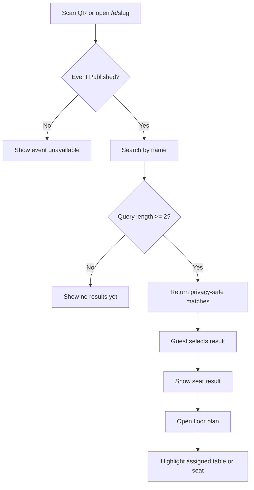
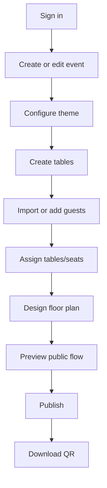
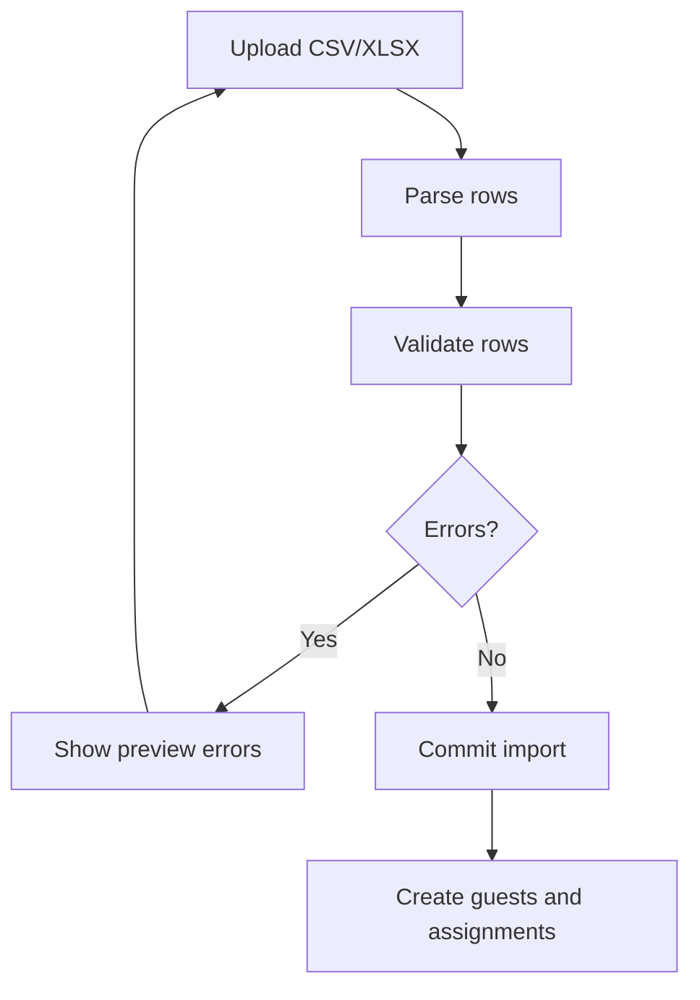
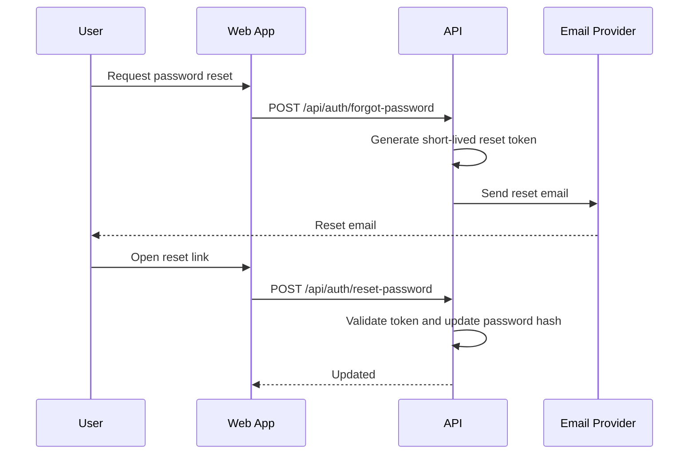

# Sassoir Project Specification

Document status: Production product specification  
Project name: Sassoir  
Last updated: 2026-09-05  
Source material reviewed: repository documentation, API code, frontend code, database schema, migrations, hosting notes, performance audit, load-test script, and client clarifications.

## Confirmed Requirements, Assumptions, and Open Items

| Type | Item |
| --- | --- |
| Confirmed | Sassoir is a production event seating and guest experience product currently in use. |
| Confirmed | This specification documents the current live production product. |
| Confirmed | Required roles are Admin, Event Planner, Host, DJ, and Public Guest. |
| Confirmed | Multi-organization tenancy is not in scope for this specification. |
| Confirmed | Event statuses remain the current statuses: `Draft`, `Published`, `Archived`. |
| Confirmed | Guest messages and contact submissions are official product features. |
| Confirmed | Public guest search must use privacy-safe duplicate disambiguation labels and must not reveal table, seat, companions, private notes, email, or phone before a guest record is selected. |
| Confirmed | XLSX import is in scope. |
| Confirmed | Password reset must be production-ready and email-backed. |
| Confirmed | Email integration is required. |
| Confirmed | Effort estimates must remain `TBD`. |
| TBD | Production file storage provider. |
| TBD | Email service provider, sender domain, templates, and delivery monitoring. |
| TBD | Detailed permissions for Event Planner, Host, and DJ beyond the role matrix in this document. |
| ASSUMPTION | The current database tables are the baseline production schema unless a table is explicitly marked as requiring modification. |
| ASSUMPTION | Existing ASP.NET Core minimal API and React/Vite architecture remains the implementation baseline. |

## Current Implementation Alignment Review

The specification applies to the Sassoir codebase, with the following required corrections or implementation gaps identified during review:

| Area | Current Project State | Required Spec/Implementation Action |
| --- | --- | --- |
| Public guest search privacy | Current backend `SearchPublicGuestsAsync` can return duplicate disambiguation from `guests.notes` or table code/name when duplicate names exist. | Must be changed to return only privacy-safe labels such as `group_label` or a dedicated safe disambiguation field. |
| Staff roles | Current backend authorization accepts only `Admin` or `SuperAdmin` through `AuthStore.IsAdmin`; Event Planner, Host, and DJ are not enforced. | Must implement role-aware authorization before issuing those role accounts. |
| Production wording/data | Current code and seed data still include `Demo Events`, fallback public event/guest data, a `Demo guest list` label, and demo-projection analytics copy. | Must remove, rename, or strictly gate these artifacts outside production. |
| Default organization | Current event creation uses a method named `GetOrCreateDemoOrganization()` with organization name `Demo Events`. | Must rename and configure this as the production/default organization because multi-organization tenancy is out of scope. |
| Password reset | Current forgot-password endpoint returns a `resetToken` in the API response. | Must send reset links by email and stop returning tokens in production responses. |
| XLSX import | Current backend supports JSON-row import and CSV preview/commit; XLSX endpoints are not implemented. | XLSX preview/commit must be added because XLSX is confirmed in scope. |
| Event removal | Current `DELETE /api/admin/events/{id}` hard-deletes the event. `Archived` status exists, but there is no reviewed archive endpoint for events. | Spec must treat hard delete as current behavior and event archive as a required product decision/implementation. |
| Table deletion | Current table deletion unassigns guests, clears seat numbers, removes linked floor-plan objects, then deletes the table. | Spec must document this current behavior and ask whether it is acceptable for production. |
| Floor-plan schema | Runtime initializer creates/adds `floor_plan_objects.seat_layout`, while base `database/schema.sql` omits it. | Base schema should be updated or migration state confirmed so bootstrap SQL and runtime schema stay consistent. |

# 1. Project Overview

## Background

Sassoir is a production event seating and guest experience platform. It allows guests to scan or open a public event URL, search for their name, view their assigned table or seat, and access a mobile-friendly floor plan that highlights their location.

The administrative product allows authorized event staff to configure events, maintain guests and tables, manage seating assignments, publish or unpublish event pages, upload event imagery, generate QR codes, view contact submissions, and review guest messages.

## Business Problem

At seated events, guests often need staff assistance to locate their table or seat. Printed charts can create queues, expose private guest information, and become outdated when assignments change. Event organizers need a fast, polished, privacy-conscious way to publish seat information and update it without reprinting materials.

## Proposed Solution

Sassoir provides a public guest flow backed by an authenticated admin portal:

- Guests search privately from a mobile browser without creating an account.
- The platform returns only privacy-safe search results until the guest selects a record.
- Seat and table details appear on the seat result page.
- The floor plan highlights the assigned table or seat.
- Admin users manage event details, branding, guests, tables, messages, contact submissions, publishing, and QR codes.

## Project Objectives

- Provide a reliable public seating lookup for live events.
- Keep public guest search fast, mobile-first, and privacy-safe.
- Support table-level and seat-level assignment modes.
- Give event staff production-ready administration tools.
- Preserve current API, schema, and frontend architecture where practical.
- Add production-grade email-backed password reset.
- Add XLSX import support in addition to current CSV/import-row flows.

## Target Users

- Admin
- Event Planner
- Host
- DJ
- Public Guest

## Expected Business Value

- Reduces event entry friction and staff workload.
- Improves the guest arrival experience.
- Allows seating changes without reprinting public materials.
- Presents a polished branded event experience.
- Creates a reusable production product for multiple events.

# 2. Scope

## In Scope

- Public event page by slug.
- Public guest search.
- Privacy-safe duplicate name disambiguation.
- Public seat result page.
- Public floor-plan display with highlighted table/seat.
- Guest messages.
- Contact submissions.
- Admin authentication.
- Email-backed password reset.
- Admin event management.
- Event publishing and unpublishing.
- Event archiving/deletion behavior as currently implemented.
- Event theme and hero image configuration.
- Guest list management.
- CSV and XLSX guest import.
- Guest export.
- Table management.
- Table-level and seat-level seating assignment modes.
- Floor-plan object management.
- QR code generation on the frontend.
- Search metrics.
- Health checks.
- Rate limiting for public endpoints.
- Structured request logging and correlation IDs.
- Render-style split hosting for frontend/API plus PostgreSQL.

## Out of Scope

- Multi-organization tenant isolation.
- Payments and subscriptions.
- Ticketing.
- RSVP management.
- Native mobile applications.
- WhatsApp/SMS unless separately approved.
- AI seating optimization.
- Custom domains per event unless separately approved.
- Microservices migration.
- Full analytics warehouse.

## Future Considerations

- Organization-level tenant isolation.
- Richer event analytics dashboards.
- RSVP and invitation links.
- Email reminders.
- SMS or WhatsApp notifications.
- Check-in workflows.
- Meal preferences and dietary restrictions.
- Object storage migration once provider is selected.
- Fine-grained event-member permissions if Host/Event Planner/DJ access must vary per event.

## Dependencies

- ASP.NET Core API.
- PostgreSQL database.
- React/Vite frontend.
- Email provider for password reset and operational email.
- Production file storage provider: `TBD`.
- DNS and hosting provider.

## Constraints

- Current architecture uses ASP.NET Core minimal API, EF Core, PostgreSQL, and React/Vite.
- Production public APIs must remain performant during event bursts.
- Public search must not reveal full guest list or private guest data.
- Event statuses are limited to `Draft`, `Published`, and `Archived`.
- Effort estimates are intentionally `TBD`.

## Assumptions

- ASSUMPTION: Existing public route pattern `/e/{slug}` remains the frontend public event URL.
- ASSUMPTION: Existing admin API route prefix `/api/admin` remains.
- ASSUMPTION: Existing public API route prefix `/api/public/events` remains.
- ASSUMPTION: PostgreSQL remains the production database.
- ASSUMPTION: File upload storage remains `TBD` until the production provider is selected.

# 3. Stakeholders and User Roles

## Roles

### Admin

Responsibilities:

- Manage production event setup and publishing.
- Maintain event details, guests, tables, floor plans, theme, contact submissions, and guest messages.
- Manage event publication state.
- Export event data.

Accessible modules:

- Admin dashboard
- Events
- Guests
- Tables
- Floor plan
- Publish
- Analytics
- Contact submissions
- Settings

Allowed actions:

- Create, read, update, publish, unpublish, archive, and delete events.
- Create, update, import, export, assign, archive, bulk delete, and delete guests.
- Create, update, and delete tables.
- Save floor-plan layouts.
- Upload event images.
- View guest messages and contact submissions.

Data visibility restrictions:

- May view full admin data for events available in the product instance.
- Must not see passwords, reset token secrets, or signing keys.

Approval authority:

- Full approval authority for production event publication.

### Event Planner

Responsibilities:

- Configure assigned events.
- Maintain guest lists, tables, seating assignments, event branding, and floor plans.
- Prepare events for publication.

Accessible modules:

- Events assigned to the planner
- Guests
- Tables
- Floor plan
- Publish preview
- Guest messages

Allowed actions:

- Create and update assigned event content.
- Import and export guests when granted by Admin.
- Update seating assignments.
- Save floor-plan layouts.
- Request publication or publish if granted.

Data visibility restrictions:

- Event-level access only.
- No access to settings outside assigned events.

Approval authority:

- CLIENT DECISION REQUIRED: confirm whether Event Planner may publish directly or only request Admin approval.

### Host

Responsibilities:

- Review event details, guest list, seating, and public guest experience.
- Provide event-specific decisions.

Accessible modules:

- Assigned event overview
- Guest list
- Seating/floor-plan preview
- Public page preview
- Guest messages if granted

Allowed actions:

- View assigned event data.
- CLIENT DECISION REQUIRED: confirm whether Host may edit guests, seating, branding, or only review.

Data visibility restrictions:

- Event-level access only.
- Sensitive notes, contact submissions, and internal settings are hidden unless explicitly granted.

Approval authority:

- CLIENT DECISION REQUIRED: confirm whether Host has approval authority for publish/unpublish decisions.

### DJ

Responsibilities:

- Access event information needed to support the live event.
- View non-sensitive event details and optional event messages relevant to the live program.

Accessible modules:

- Assigned event overview
- Floor-plan view
- Event schedule/program if added later
- CLIENT DECISION REQUIRED: confirm whether DJ can view guest messages.

Allowed actions:

- View assigned event information.
- No default guest, seating, table, or publishing edits.

Data visibility restrictions:

- No guest contact information.
- No private guest notes.
- No admin settings.

Approval authority:

- None.

### Public Guest

Responsibilities:

- Search for their name and locate their table or seat.
- Optionally submit a guest message.

Accessible modules:

- Public event page
- Guest search
- Seat result
- Floor plan
- Guest message form

Allowed actions:

- Search by name.
- Select matching guest result.
- View own public seat result.
- View floor plan for selected guest.
- Submit message for selected guest.

Data visibility restrictions:

- No account access.
- Cannot access admin APIs.
- Search results must not expose table, seat, companions, private notes, email, or phone.

Approval authority:

- None.

## Role-Permission Matrix

| Module / Action | Admin | Event Planner | Host | DJ | Public Guest |
| --- | --- | --- | --- | --- | --- |
| Sign in to admin portal | Yes | Yes | Yes | Yes | No |
| View public event page | Yes | Yes | Yes | Yes | Yes |
| Search public guest names | Yes | Yes | Yes | Yes | Yes |
| View selected public seat result | Yes | Yes | Yes | Limited | Yes |
| View admin dashboard | Yes | Limited | No | No | No |
| Create event | Yes | CLIENT DECISION REQUIRED | No | No | No |
| Edit event details | Yes | Yes, assigned events | CLIENT DECISION REQUIRED | No | No |
| Publish/unpublish event | Yes | CLIENT DECISION REQUIRED | CLIENT DECISION REQUIRED | No | No |
| Archive/delete event | Yes | No | No | No | No |
| Manage guests | Yes | Yes, assigned events | CLIENT DECISION REQUIRED | No | No |
| Import CSV/XLSX guests | Yes | Yes, assigned events | No | No | No |
| Export guests | Yes | Yes, assigned events | CLIENT DECISION REQUIRED | No | No |
| Manage tables | Yes | Yes, assigned events | CLIENT DECISION REQUIRED | No | No |
| Save floor plan | Yes | Yes, assigned events | CLIENT DECISION REQUIRED | No | No |
| View floor plan | Yes | Yes | Yes | Yes | Yes for selected guest |
| Upload event image | Yes | Yes, assigned events | CLIENT DECISION REQUIRED | No | No |
| View guest messages | Yes | Yes, assigned events | CLIENT DECISION REQUIRED | CLIENT DECISION REQUIRED | Own submitted message only after submit |
| View contact submissions | Yes | No | No | No | No |
| Change own password | Yes | Yes | Yes | Yes | No |
| Request password reset | Yes | Yes | Yes | Yes | No |

Implementation note: current backend authorization checks Admin/SuperAdmin-style roles through `AuthStore.IsAdmin`. Event Planner, Host, and DJ enforcement is a production authorization gap and must be implemented before granting those role accounts access.

# 4. Functional Requirements

## Public Event Module

### FR-001 - Load Published Public Event

Purpose: Display event details and public branding by event slug.

Actors: Public Guest, Admin, Event Planner, Host, DJ.

Preconditions:

- Event exists.
- Event status is `Published`.

Main workflow:

1. User opens `/e/{slug}`.
2. Frontend requests `GET /api/public/events/{slug}`.
3. API validates published status.
4. API returns public event fields and theme.
5. Frontend displays the public welcome page.

Alternative workflows:

- If event is missing or not published, show not-found/unavailable state.
- If API is offline, show offline state.

Validation rules:

- Slug is normalized as lowercase URL-safe text.

Business rules:

- BR-001 applies.
- BR-002 applies.

Status changes:

- None.

Notifications:

- None.

Permissions:

- Public endpoint.

Error scenarios:

- `404 Not Found` if event is missing or not published.
- `429 Too Many Requests` if rate limit is exceeded.
- `500 Internal Server Error` for unexpected failures.

Expected result:

- Published public event details are displayed without exposing admin-only fields.

### FR-002 - Public Guest Search

Purpose: Allow a guest to search for their name without exposing the full guest list.

Actors: Public Guest.

Preconditions:

- Event exists and is `Published`.
- Guest search query contains at least 2 normalized characters.

Main workflow:

1. Guest enters a full or partial name.
2. Frontend debounces the search request.
3. Frontend sends `POST /api/public/events/{slug}/guests/search`.
4. API normalizes the query.
5. API searches active guests and aliases.
6. API returns up to 10 privacy-safe results.
7. Frontend displays result choices.

Alternative workflows:

- Query shorter than 2 characters returns an empty result set.
- No match returns an empty result set and a user-friendly empty state.
- Duplicate names are disambiguated using safe labels only.

Validation rules:

- Query is required in the request body.
- Query is trimmed, lowercased, accent-normalized, whitespace-normalized, and Arabic-normalized.

Business rules:

- BR-003 through BR-009 apply.

Status changes:

- None.

Notifications:

- None.

Permissions:

- Public endpoint.

Error scenarios:

- `400 Bad Request` if request body is malformed.
- `429 Too Many Requests` if rate limit is exceeded.
- `500 Internal Server Error` for unexpected failures.

Expected result:

- Guest sees only privacy-safe result choices and cannot browse the full guest list.

### FR-003 - Public Seat Result

Purpose: Show a selected guest's seating result after they choose a public search result.

Actors: Public Guest.

Preconditions:

- Event is `Published`.
- Guest `publicToken` exists for the event.
- Guest status is valid for public access.

Main workflow:

1. Guest selects a search result.
2. Frontend requests `GET /api/public/events/{slug}/guests/{publicToken}`.
3. API returns guest display name, group label, table, optional seat, directions, companions, event details, floor plan, and highlighted object ID.
4. Frontend displays seating information.

Alternative workflows:

- If the selected guest has no table, display unassigned messaging with `TBD` operational copy.
- If no floor-plan object is linked to the table, display seat result without highlight.

Validation rules:

- Public token is treated as an opaque public identifier.

Business rules:

- BR-010 through BR-014 apply.

Status changes:

- None.

Notifications:

- None.

Permissions:

- Public endpoint.

Error scenarios:

- `404 Not Found` if event or guest is missing.
- `429 Too Many Requests` if rate limit is exceeded.

Expected result:

- Guest can identify assigned table or seat and proceed to floor plan.

### FR-004 - Public Floor Plan

Purpose: Display the active floor plan and highlight the selected guest's assigned table or seat.

Actors: Public Guest.

Preconditions:

- Event is `Published`.
- Active floor plan exists.
- Guest token exists.

Main workflow:

1. Guest opens floor plan from seat result.
2. Frontend uses floor plan included in seat result or requests `GET /api/public/events/{slug}/guests/{publicToken}/floor-plan`.
3. API returns floor plan objects and highlighted object ID.
4. Frontend renders the layout with zoom/pan behavior and highlight.

Alternative workflows:

- If floor plan is missing, display an unavailable floor-plan message.
- If highlight is missing, show full floor plan without table focus.

Validation rules:

- Floor-plan coordinates must be normalized within supported ranges.

Business rules:

- BR-015 through BR-018 apply.

Status changes:

- None.

Notifications:

- None.

Permissions:

- Public endpoint for selected guest token.

Error scenarios:

- `404 Not Found` if event, guest, or floor plan is missing.
- `429 Too Many Requests` if rate limit is exceeded.

Expected result:

- Guest can visually locate their assignment on mobile.

### FR-005 - Public Guest Message

Purpose: Allow a selected public guest to submit a message associated with their guest record.

Actors: Public Guest.

Preconditions:

- Event is `Published`.
- Guest token is valid.

Main workflow:

1. Guest enters a message.
2. Frontend sends `POST /api/public/events/{slug}/guests/{publicToken}/messages`.
3. API validates non-empty message.
4. API stores message with event ID, guest ID, and timestamp.
5. API returns created status.

Alternative workflows:

- Empty message is rejected.
- Unknown guest token returns not found.

Validation rules:

- Message is required.
- Maximum message length is `TBD`.

Business rules:

- BR-019 applies.

Status changes:

- None.

Notifications:

- ASSUMPTION: Message storage does not currently trigger email notifications.

Permissions:

- Public endpoint for selected guest token.

Error scenarios:

- `400 Bad Request` for empty message.
- `404 Not Found` for missing event or guest.
- `429 Too Many Requests` if message rate limit is exceeded.

Expected result:

- Message is available to authorized staff in the admin portal.

## Admin Authentication Module

### FR-006 - Admin Sign-In

Purpose: Authenticate staff users for protected admin modules.

Actors: Admin, Event Planner, Host, DJ.

Preconditions:

- User account exists.
- User status is `Active`.

Main workflow:

1. User enters email and password.
2. Frontend sends `POST /api/auth/login`.
3. API verifies PBKDF2 password hash.
4. API returns access token, refresh token, role list, display name, and expirations.
5. Frontend stores auth session for API calls.

Alternative workflows:

- Invalid credentials return unauthorized.
- Inactive user cannot log in.

Validation rules:

- Email and password are required.

Business rules:

- BR-020 through BR-023 apply.

Status changes:

- User `last_login_at` is updated after successful login.

Notifications:

- Failed login alerting is `TBD`.

Permissions:

- Public auth endpoint.

Error scenarios:

- `401 Unauthorized` for invalid credentials.
- `500 Internal Server Error` if signing key is invalid or service fails.

Expected result:

- User receives a valid session scoped by role.

### FR-007 - Token Refresh

Purpose: Allow active users to refresh access tokens.

Actors: Admin, Event Planner, Host, DJ.

Preconditions:

- Refresh token is valid and unexpired.
- User remains active.

Main workflow:

1. Frontend sends `POST /api/auth/refresh`.
2. API validates refresh token type and signature.
3. API loads active user and roles.
4. API returns new access and refresh tokens.

Alternative workflows:

- Invalid or expired token returns unauthorized.

Validation rules:

- Refresh token is required.

Business rules:

- BR-024 applies.

Status changes:

- None.

Notifications:

- None.

Permissions:

- Public auth endpoint with signed refresh token.

Error scenarios:

- `401 Unauthorized`.

Expected result:

- User session continues without full reauthentication.

### FR-008 - Email-Backed Password Reset

Purpose: Provide production-ready password reset through email.

Actors: Admin, Event Planner, Host, DJ.

Preconditions:

- Email integration is configured.
- User account exists and is active.

Main workflow:

1. User requests password reset with email.
2. API generates time-limited password reset token.
3. API sends reset email using configured provider.
4. User opens reset link and submits new password.
5. API validates token and password.
6. API updates password hash.

Alternative workflows:

- Unknown email returns the same generic success message.
- Expired token returns unauthorized.
- Weak password returns validation error.

Validation rules:

- Email must be valid.
- New password must be at least 8 characters.
- Additional password complexity rules are `TBD`.

Business rules:

- BR-025 through BR-028 apply.

Status changes:

- User password hash and `updated_at` change.

Notifications:

- Password reset email is sent.

Permissions:

- Public auth endpoint with reset token.

Error scenarios:

- `400 Bad Request` for weak password.
- `401 Unauthorized` for invalid token.
- `502 Bad Gateway` or equivalent for email provider failure.

Expected result:

- User can recover access without exposing reset token in API response.

Implementation note: existing code returns `resetToken` in the forgot-password response. This must be changed for production readiness.

## Admin Event Module

### FR-009 - Event List and Dashboard

Purpose: Show authorized users the events and event metrics available to them.

Actors: Admin, Event Planner, Host, DJ with limited access.

Preconditions:

- User is authenticated.

Main workflow:

1. User opens admin dashboard or events page.
2. Frontend calls `GET /api/admin/events` or `GET /api/admin/events/page`.
3. API validates authorization.
4. API returns event summaries including guest count and assigned count.
5. Frontend displays dashboard metrics and event list.

Alternative workflows:

- Paginated endpoint supports search, status, page, and page size.

Validation rules:

- Page defaults to 1.
- Page size defaults to 25 and is capped at 100.

Business rules:

- BR-029 through BR-031 apply.

Status changes:

- None.

Notifications:

- None.

Permissions:

- Admin full access.
- Event Planner/Host/DJ event visibility is role-scoped and requires implementation.

Error scenarios:

- `401 Unauthorized`.

Expected result:

- User sees only authorized production event records.

### FR-010 - Create Event

Purpose: Create a production event record with required public configuration.

Actors: Admin, Event Planner if granted.

Preconditions:

- User is authenticated and authorized.

Main workflow:

1. User enters event details.
2. Frontend sends `POST /api/admin/events`.
3. API validates request fields.
4. API checks slug uniqueness.
5. API creates event, theme, default floor plan as needed.
6. API returns created event DTO.

Alternative workflows:

- Slug conflict returns conflict.
- Validation errors return field-level validation problem.

Validation rules:

- Name is required.
- Slug is required.
- Slug must contain lowercase letters, numbers, and hyphens only.
- Theme colors must be valid `#RRGGBB` values when supplied.

Business rules:

- BR-032 through BR-037 apply.

Status changes:

- Initial status is `Draft` unless otherwise supplied and permitted.

Notifications:

- None.

Permissions:

- Admin.
- CLIENT DECISION REQUIRED: Event Planner create permission.

Error scenarios:

- `400 Bad Request` or validation problem.
- `401 Unauthorized`.
- `409 Conflict`.

Expected result:

- Event is created and available for configuration.

### FR-011 - Update Event

Purpose: Update event details, theme, seating assignment mode, and publication status fields.

Actors: Admin, Event Planner if assigned.

Preconditions:

- Event exists.
- User is authorized.

Main workflow:

1. User edits event fields.
2. Frontend sends `PUT /api/admin/events/{id}`.
3. API validates request.
4. API persists updates.
5. API invalidates relevant public caches.
6. API returns updated event DTO.

Alternative workflows:

- Missing event returns not found.
- Slug conflict returns conflict.

Validation rules:

- Same as create event.

Business rules:

- BR-032 through BR-039 apply.

Status changes:

- Event status may remain unchanged or move among allowed statuses according to lifecycle rules.

Notifications:

- ASSUMPTION: No automatic public notification is sent when event details change.

Permissions:

- Admin.
- Event Planner for assigned events if granted.

Error scenarios:

- `400`, `401`, `404`, `409`.

Expected result:

- Event configuration is updated for admin and public views.

### FR-012 - Publish and Unpublish Event

Purpose: Control public availability of an event.

Actors: Admin, Event Planner/Host if granted.

Preconditions:

- Event exists.
- User has publication authority.

Main workflow:

1. User selects publish or unpublish.
2. Frontend sends `POST /api/admin/events/{id}/publish` or `/unpublish`.
3. API sets status to `Published` or `Draft`.
4. API updates `published_at` when publishing.
5. API invalidates public caches.
6. API returns updated event DTO.

Alternative workflows:

- Missing event returns not found.

Validation rules:

- Publish validation completeness rules are currently limited; production completeness requirements are listed in BR-040.

Business rules:

- BR-040 through BR-043 apply.

Status changes:

- `Draft` to `Published`.
- `Published` to `Draft`.

Notifications:

- None unless email notification is separately configured.

Permissions:

- Admin.
- CLIENT DECISION REQUIRED: Event Planner/Host publish authority.

Error scenarios:

- `401 Unauthorized`.
- `404 Not Found`.

Expected result:

- Public page availability changes immediately.

### FR-013 - Archive or Delete Event

Purpose: Remove events from active administration and define the required archive behavior.

Actors: Admin.

Preconditions:

- Event exists.
- User is authorized.

Main workflow:

1. User initiates delete action.
2. Frontend requests `DELETE /api/admin/events/{id}`.
3. API hard-deletes the event record according to the current implementation.

Alternative workflows:

- CLIENT DECISION REQUIRED: confirm whether production event removal should remain hard delete or move to soft archive using `Archived`.

Validation rules:

- Destructive actions require explicit UI confirmation.

Business rules:

- BR-044 applies.

Status changes:

- Current behavior: event is hard-deleted.
- Required decision: event may become `Archived` instead if soft archive is approved.

Notifications:

- None.

Permissions:

- Admin only.

Error scenarios:

- `401 Unauthorized`.
- `404 Not Found`.

Expected result:

- Event is no longer available for admin or public use after hard delete. If archive is implemented, archived events must not be publicly available.

## Guest Management Module

### FR-014 - List, Search, and Filter Guests

Purpose: Let staff manage event guests efficiently.

Actors: Admin, Event Planner, Host if granted.

Preconditions:

- Event exists.
- User is authenticated and authorized.

Main workflow:

1. User opens guest list.
2. Frontend calls `GET /api/admin/events/{id}/guests/page`.
3. API applies search, status, table filter, page, and page size.
4. API returns paginated guest DTOs.

Alternative workflows:

- Compatibility unpaginated endpoint exists at `GET /api/admin/events/{id}/guests`.

Validation rules:

- Page size capped at 100.

Business rules:

- BR-045 through BR-048 apply.

Status changes:

- None.

Notifications:

- None.

Permissions:

- Admin.
- Event Planner for assigned events.
- Host if granted read access.

Error scenarios:

- `401 Unauthorized`.
- `404 Not Found`.

Expected result:

- User can view guests with assignment and duplicate indicators.

### FR-015 - Create or Update Guest

Purpose: Maintain individual guest records.

Actors: Admin, Event Planner, Host if granted.

Preconditions:

- Event exists.
- User is authorized.

Main workflow:

1. User enters guest details.
2. Frontend sends `POST /api/admin/events/{id}/guests` or `PUT /api/admin/events/{eventId}/guests/{guestId}`.
3. API validates display/name requirement.
4. API validates assignment rules if table/seat is supplied.
5. API saves guest and returns admin guest DTO.

Alternative workflows:

- Missing first name and display name is rejected.
- Full table or duplicate seat is rejected.

Validation rules:

- First name or display name is required.
- Person count defaults to at least 1.
- Table must belong to same event.
- Seat mode requires valid seat number.

Business rules:

- BR-049 through BR-058 apply.

Status changes:

- Guest may be `Active`, `Cancelled`, `CheckedIn`, or `Archived`.

Notifications:

- None.

Permissions:

- Admin.
- Event Planner for assigned events.
- Host if granted edit access.

Error scenarios:

- `400 Bad Request`.
- `401 Unauthorized`.
- `404 Not Found`.

Expected result:

- Guest record is saved with valid assignment constraints.

### FR-016 - Archive, Delete, and Bulk Delete Guests

Purpose: Remove guests from active workflows.

Actors: Admin, Event Planner if granted.

Preconditions:

- Event exists.
- Guest exists.
- User is authorized.

Main workflow:

1. User chooses archive, delete, or bulk delete.
2. API updates status to `Archived` or deletes records based on selected endpoint.
3. API returns updated guest or deletion count.

Alternative workflows:

- Missing guest returns not found.

Validation rules:

- Bulk request requires guest IDs.

Business rules:

- BR-059 through BR-061 apply.

Status changes:

- `Active`, `Cancelled`, or `CheckedIn` to `Archived`.
- Hard delete removes record.

Notifications:

- None.

Permissions:

- Admin.
- Event Planner if granted.

Error scenarios:

- `400`, `401`, `404`.

Expected result:

- Archived/deleted guests no longer count in public search or seating capacity.

### FR-017 - Assign Guests to Tables or Seats

Purpose: Manage seating assignments.

Actors: Admin, Event Planner.

Preconditions:

- Event exists.
- Guest exists.
- Table exists if assigning.

Main workflow:

1. User selects guest(s) and table.
2. In seat mode, user selects seat number.
3. API validates capacity and seat rules.
4. API saves assignment.
5. API returns updated guest(s).

Alternative workflows:

- Null table unassigns guest from table/seat.
- Bulk assign supports many guests to one table in table mode.

Validation rules:

- Table must belong to event.
- In `seat` mode, seat number must be integer from 1 to table capacity.
- Seat number must be unique within a table for guests counting toward seating.
- In `table` mode, total `person_count` cannot exceed table capacity.

Business rules:

- BR-062 through BR-068 apply.

Status changes:

- Guest status does not change.

Notifications:

- None.

Permissions:

- Admin.
- Event Planner.

Error scenarios:

- `400` for full table or invalid seat.
- `401`.
- `404`.

Expected result:

- Seating assignment is valid and reflected in public guest results after selection.

### FR-018 - Import Guests from CSV or XLSX

Purpose: Bulk load guests from spreadsheet files.

Actors: Admin, Event Planner.

Preconditions:

- Event exists.
- User is authorized.
- File is CSV or XLSX.

Main workflow:

1. User uploads or provides import rows.
2. API parses CSV/XLSX into guest import rows.
3. API previews import using validation rules.
4. User reviews errors and duplicate indicators.
5. User commits valid rows.
6. API creates guest records and assignments.

Alternative workflows:

- Current CSV preview/commit endpoints accept raw CSV text.
- Current JSON preview/commit endpoints accept row arrays.
- XLSX support must map worksheets to the same import row schema.

Validation rules:

- Supported columns include first name, last name, display name, notes, person count, table number, table name, and seat number.
- XLSX maximum size is `TBD`.
- XLSX maximum rows per import is `TBD`.

Business rules:

- BR-069 through BR-078 apply.

Status changes:

- New guests are created as `Active`.

Notifications:

- Import completion email is `TBD`.

Permissions:

- Admin.
- Event Planner.

Error scenarios:

- `400` for invalid rows.
- `401`.
- `404`.
- File parsing failure.

Expected result:

- Valid guest rows are imported without violating table/seat constraints.

Implementation note: current code supports CSV and JSON-row imports. XLSX parsing and API endpoints must be added.

### FR-019 - Export Guests

Purpose: Export guests for operational review or backup.

Actors: Admin, Event Planner if granted.

Preconditions:

- Event exists.
- User is authorized.

Main workflow:

1. User requests export.
2. API returns CSV file from `GET /api/admin/events/{id}/guests/export`.

Alternative workflows:

- XLSX export is `TBD`.

Validation rules:

- Export must prevent spreadsheet formula injection.

Business rules:

- BR-079 applies.

Status changes:

- None.

Notifications:

- None.

Permissions:

- Admin.
- Event Planner if granted.

Error scenarios:

- `401`.
- `404`.

Expected result:

- CSV download contains production guest data appropriate for authorized staff.

## Table and Floor Plan Module

### FR-020 - Manage Tables

Purpose: Create and maintain event tables.

Actors: Admin, Event Planner.

Preconditions:

- Event exists.
- User is authorized.

Main workflow:

1. User opens table management.
2. User creates or edits table name, number/code, capacity, shape, and notes.
3. API validates required fields and capacity.
4. API saves table.

Alternative workflows:

- Paginated and unpaginated table list endpoints are available.
- Table delete is supported.

Validation rules:

- Name is required.
- Number/code is required.
- Capacity must be greater than zero.
- Code must be unique per event.
- Supported shapes are `round`, `square`, `rectangle`, and current code also accepts `tear`.

Business rules:

- BR-080 through BR-086 apply.

Status changes:

- None.

Notifications:

- None.

Permissions:

- Admin.
- Event Planner.

Error scenarios:

- `400`, `401`, `404`, `409`.

Expected result:

- Table inventory reflects capacity and assignment counts.

### FR-021 - Manage Floor Plan

Purpose: Create and save the event layout used by public guests and staff.

Actors: Admin, Event Planner.

Preconditions:

- Event exists.
- User is authorized.

Main workflow:

1. User opens floor-plan designer.
2. Frontend loads `GET /api/admin/events/{id}/floor-plan`.
3. User adds, positions, resizes, rotates, and links objects.
4. Frontend sends `PUT /api/admin/events/{id}/floor-plan`.
5. API normalizes and saves objects.
6. API returns floor plan DTO.

Alternative workflows:

- Missing floor plan can be created automatically by the store.
- Objects may be visible or hidden.

Validation rules:

- X and Y are clamped between 0 and 1.
- Width and height are positive and at most 1.
- Rotation is normalized between 0 and 359.999.
- Seat layout positions are normalized and capped.

Business rules:

- BR-087 through BR-094 apply.

Status changes:

- None.

Notifications:

- None.

Permissions:

- Admin.
- Event Planner.

Error scenarios:

- `401`.
- `404`.
- `400` if malformed payload.

Expected result:

- Public floor plan reflects the latest saved active layout.

## Contact and Messaging Module

### FR-022 - Contact Submissions

Purpose: Capture and review inquiries submitted through the public/contact surface.

Actors: Public user, Admin.

Preconditions:

- Contact form is available.

Main workflow:

1. User submits name, email, and message to `POST /api/contact`.
2. API validates fields and email format.
3. API stores submission.
4. Admin reviews submissions from `GET /api/contact`.

Alternative workflows:

- Validation failures return field-level errors.

Validation rules:

- Name is required.
- Email is required and must be valid.
- Message is required.

Business rules:

- BR-095 through BR-097 apply.

Status changes:

- None.

Notifications:

- Email notification to staff is `TBD`.

Permissions:

- Submit is public.
- Review is Admin only.

Error scenarios:

- `400` validation problem.
- `401` for admin review without auth.

Expected result:

- Contact submission is stored with UTC timestamp.

### FR-023 - View Guest Messages

Purpose: Let authorized staff review messages submitted by guests.

Actors: Admin, Event Planner, Host/DJ if granted.

Preconditions:

- Event exists.
- Messages exist.
- User is authorized.

Main workflow:

1. User opens messages view.
2. Frontend calls `GET /api/admin/events/{id}/messages/page` or compatibility list endpoint.
3. API returns paginated guest messages ordered by creation time.

Alternative workflows:

- Empty state shown when no messages exist.

Validation rules:

- Page size capped at 100.

Business rules:

- BR-098 applies.

Status changes:

- None.

Notifications:

- None currently.

Permissions:

- Admin.
- Event Planner assigned events.
- Host/DJ access requires client confirmation.

Error scenarios:

- `401`.
- `404`.

Expected result:

- Staff can read messages associated with guest names.

## Upload and QR Module

### FR-024 - Event Image Upload

Purpose: Upload event hero/branding images.

Actors: Admin, Event Planner.

Preconditions:

- User is authenticated and authorized.
- Request is multipart form data.

Main workflow:

1. User chooses an image file.
2. Frontend sends `POST /api/admin/uploads/event-image`.
3. API validates file type and size.
4. API returns upload URL.
5. Frontend stores URL in event theme.

Alternative workflows:

- Current implementation returns a base64 data URL.
- Production storage provider remains `TBD`.

Validation rules:

- File required.
- Maximum size is 5 MB.
- Supported extensions: `.jpg`, `.jpeg`, `.png`, `.webp`, `.gif`.

Business rules:

- BR-099 through BR-102 apply.

Status changes:

- None.

Notifications:

- None.

Permissions:

- Admin.
- Event Planner.

Error scenarios:

- `400`.
- `401`.
- Storage provider failure once configured.

Expected result:

- Event image is available for public page rendering.

### FR-025 - QR Code Generation

Purpose: Generate event QR codes pointing to public event URLs.

Actors: Admin, Event Planner.

Preconditions:

- Event exists and has a slug.

Main workflow:

1. User opens publish/share view.
2. Frontend builds public event URL from current origin and event slug.
3. Frontend generates QR SVG/data URI.
4. User downloads QR SVG.

Alternative workflows:

- Production base URL may be overridden by environment configuration if needed.

Validation rules:

- Event slug is required.

Business rules:

- BR-103 applies.

Status changes:

- None.

Notifications:

- None.

Permissions:

- Admin.
- Event Planner if granted.

Error scenarios:

- Missing slug prevents QR generation.

Expected result:

- QR code opens `/e/{slug}`.

# 5. User Journeys and Workflows

## Guest Seating Lookup

1. Guest scans QR code or opens event URL.
2. Public event page loads only if event is `Published`.
3. Guest enters at least 2 characters.
4. Search results show privacy-safe labels only.
5. Guest selects their result.
6. Seat result displays table, optional seat, directions, companions, event details, and floor-plan entry.
7. Guest opens floor plan.
8. Floor plan highlights assigned table/seat.



## Admin Event Setup

1. Staff user signs in.
2. User creates or edits event details.
3. User configures theme and hero image.
4. User creates tables.
5. User imports guests through CSV/XLSX or adds guests manually.
6. User assigns tables/seats.
7. User saves floor-plan objects.
8. User reviews public page.
9. User publishes event.
10. User downloads QR code.



## Guest Import Workflow

1. User uploads CSV or XLSX.
2. System parses rows into common import schema.
3. System validates names, duplicate display names, table references, person counts, and seats.
4. User reviews preview.
5. User fixes invalid rows or proceeds with valid data.
6. System commits rows.
7. Imported guests become searchable after event publication.



## Password Reset Workflow



# 6. Statuses and Lifecycle

## Event Statuses

Available statuses:

- `Draft`
- `Published`
- `Archived`

Initial status:

- `Draft`

| From | To | Actor | Conditions | Triggered Actions | Reversible |
| --- | --- | --- | --- | --- | --- |
| None | Draft | Admin, Event Planner if granted | Valid create request | Create event and theme/default floor plan as applicable | No |
| Draft | Published | Admin, Event Planner/Host if granted | Publish validation passes | Set public availability, set `published_at`, invalidate public cache | Yes |
| Published | Draft | Admin, Event Planner/Host if granted | Event exists | Remove public availability, invalidate public cache | Yes |
| Draft | Archived | Admin | CLIENT DECISION REQUIRED: archival workflow | Hide from active admin/public use | Yes, if unarchive is implemented |
| Published | Archived | Admin | CLIENT DECISION REQUIRED: whether published events can be archived directly | Hide from public use | Yes, if unarchive is implemented |
| Archived | Draft | Admin | CLIENT DECISION REQUIRED | Restore editable event | Yes |

## Guest Statuses

Available statuses:

- `Active`
- `Cancelled`
- `CheckedIn`
- `Archived`

Initial status:

- `Active`

| From | To | Actor | Conditions | Triggered Actions | Reversible |
| --- | --- | --- | --- | --- | --- |
| None | Active | Admin, Event Planner | Valid guest create/import | Generate public token and normalized search name | No |
| Active | CheckedIn | Admin, Event Planner | Check-in action or manual status update | Counts toward seating | Yes |
| Active | Cancelled | Admin, Event Planner | Manual update | Excluded from seating count where code applies | Yes |
| Active | Archived | Admin, Event Planner if granted | Archive action | Removed from public search and active admin counts | Yes by update if supported |
| Cancelled | Active | Admin, Event Planner | Manual update | Restores seating count if assigned | Yes |
| CheckedIn | Active | Admin, Event Planner | Manual update | Keeps assignment | Yes |
| Any | Deleted | Admin | Hard delete endpoint invoked | Removes guest record | No |

## Floor Plan Lifecycle

| Entity | Status/Flag | Initial | Transition | Actor | Conditions | Triggered Actions | Reversible |
| --- | --- | --- | --- | --- | --- | --- | --- |
| Floor plan | `is_active=true` | True for default/current plan | Active to inactive | Admin/Event Planner | CLIENT DECISION REQUIRED: inactive plan UI | Public viewer uses active plan only | Yes |
| Floor-plan object | `is_visible=true/false` | True | Visible to hidden | Admin/Event Planner | Object exists | Hidden objects excluded from public plan | Yes |

## Contact Submission Lifecycle

| From | To | Actor | Conditions | Triggered Actions | Reversible |
| --- | --- | --- | --- | --- | --- |
| None | Stored | Public user | Valid name, email, message | Store timestamped record | No |
| Stored | Deleted/Archived | Admin | CLIENT DECISION REQUIRED | Remove or hide submission | TBD |

## Guest Message Lifecycle

| From | To | Actor | Conditions | Triggered Actions | Reversible |
| --- | --- | --- | --- | --- | --- |
| None | Stored | Public Guest | Valid event, token, non-empty message | Store timestamped guest message | No |
| Stored | Deleted/Archived | Admin | CLIENT DECISION REQUIRED | Remove or hide message | TBD |

# 7. Data Model

## Existing Tables

### organizations

Purpose: Stores product organization records, although multi-organization tenancy is not in scope for this specification.

| Field | Type | Required | Notes |
| --- | --- | --- | --- |
| id | uuid | Yes | Primary key, default `gen_random_uuid()` |
| name | text | Yes | Organization name |
| slug | text | Yes | Unique |
| status | text | Yes | Default `Active` |
| created_at | timestamptz | Yes | Default `now()` |
| updated_at | timestamptz | Yes | Default `now()` |

### events

Purpose: Stores event configuration and public status.

| Field | Type | Required | Notes |
| --- | --- | --- | --- |
| id | uuid | Yes | Primary key |
| organization_id | uuid | Yes | FK to `organizations.id` |
| name | text | Yes | Event name |
| slug | text | Yes | Unique public slug |
| event_type | text | Yes | Default `Wedding` |
| subtitle | text | Yes | Public subtitle |
| description | text | Yes | Admin/detail description |
| date_label | text | Yes | Human-readable date label |
| venue_name | text | Yes | Venue name |
| venue_address | text | Yes | Venue address |
| seating_assignment_mode | text | Yes | `table` or `seat`; default `table` |
| status | text | Yes | `Draft`, `Published`, `Archived` |
| is_public | boolean | Yes | Existing field; status is the authoritative public gate in current code |
| published_at | timestamptz | No | Set when published |
| created_at | timestamptz | Yes | Audit timestamp |
| updated_at | timestamptz | Yes | Audit timestamp |

Unique constraints:

- `events.slug`

Indexes:

- `ix_events_organization_id`
- `ix_events_slug_status`

### event_themes

Purpose: Stores event-specific public branding.

| Field | Type | Required | Notes |
| --- | --- | --- | --- |
| id | uuid | Yes | Primary key |
| event_id | uuid | Yes | Unique FK to `events.id` |
| logo_text | text | Yes | Public text logo/monogram |
| hero_text | text | Yes | Public hero copy |
| primary_color | text | Yes | Default `#D8CFBC` |
| secondary_color | text | Yes | Default `#565449` |
| background_color | text | Yes | Default `#FFFBF4` |
| text_color | text | Yes | Default `#11120D` |
| welcome_title | text | Yes | Public title |
| search_input_label | text | Yes | Default `Search by name` |
| search_placeholder | text | Yes | Default `Search by name` |
| hero_image_url | text | No | Event hero image URL/data URL |
| logo_url | text | No | Existing DB field |
| updated_at | timestamptz | Yes | Timestamp |

### guest_groups

Purpose: Stores guest group labels.

Current implementation note: table exists in SQL but EF DbSet is not exposed in the reviewed context.

| Field | Type | Required | Notes |
| --- | --- | --- | --- |
| id | uuid | Yes | Primary key |
| event_id | uuid | Yes | FK to `events.id` |
| name | text | Yes | Group name |
| description | text | No | Group description |

### event_tables

Purpose: Stores event table inventory and capacities.

| Field | Type | Required | Notes |
| --- | --- | --- | --- |
| id | uuid | Yes | Primary key |
| event_id | uuid | Yes | FK to `events.id` |
| name | text | Yes | Table display name |
| code | text | Yes | Table number/code |
| shape | text | Yes | Default `Round` |
| capacity | integer | Yes | Must be > 0 |
| notes | text | No | Internal/admin notes |
| zone_name | text | No | Zone label |
| floor_plan_x | numeric | No | Existing schema field |
| floor_plan_y | numeric | No | Existing schema field |
| floor_plan_width | numeric | No | Existing schema field |
| floor_plan_height | numeric | No | Existing schema field |
| rotation | numeric | Yes | Default 0 |
| created_at | timestamptz | Yes | Timestamp |
| updated_at | timestamptz | Yes | Timestamp |

Unique constraints:

- `(event_id, code)`

### guests

Purpose: Stores guest identity, search data, seating assignment, public token, and public-safe labels.

| Field | Type | Required | Notes |
| --- | --- | --- | --- |
| id | uuid | Yes | Internal primary key |
| event_id | uuid | Yes | FK to `events.id` |
| guest_group_id | uuid | No | FK to `guest_groups.id` |
| table_id | uuid | No | FK to `event_tables.id` |
| first_name | text | Yes | Default empty |
| last_name | text | Yes | Default empty |
| display_name | text | Yes | Required display name |
| normalized_search_name | text | Yes | Search-optimized normalized name |
| public_token | text | Yes | Unique public token |
| group_label | text | Yes | Public-safe disambiguation label |
| seat_number | text | No | Required only in seat mode when assigned |
| directions | text | Yes | Public directions copy |
| email | text | No | Private |
| phone | text | No | Private |
| notes | text | No | Private/admin; must not appear in public search |
| person_count | integer | Yes | Default 1 |
| status | text | Yes | `Active`, `Cancelled`, `CheckedIn`, `Archived` |
| created_at | timestamptz | Yes | Timestamp |
| updated_at | timestamptz | Yes | Timestamp |

Unique constraints:

- `public_token`

Indexes:

- `ix_guests_event_search`
- `ix_guests_normalized_search_name_trgm`
- `ix_guests_event_status_table`
- `ix_guests_event_public_token`

### guest_search_aliases

Purpose: Supports alternative spellings, nicknames, Arabic names, and transliterations.

| Field | Type | Required | Notes |
| --- | --- | --- | --- |
| id | uuid | Yes | Primary key |
| guest_id | uuid | Yes | FK to `guests.id` |
| alias | text | Yes | Original alias |
| normalized_alias | text | Yes | Search-normalized alias |

### floor_plans

Purpose: Stores floor-plan metadata.

| Field | Type | Required | Notes |
| --- | --- | --- | --- |
| id | uuid | Yes | Primary key |
| event_id | uuid | Yes | FK to `events.id` |
| name | text | Yes | Floor-plan name |
| canvas_aspect_ratio | numeric | Yes | Default 1.14 |
| version | integer | Yes | Default 1 |
| is_active | boolean | Yes | Public plan selector |
| created_at | timestamptz | Yes | Timestamp |

### floor_plan_objects

Purpose: Stores normalized floor-plan objects.

| Field | Type | Required | Notes |
| --- | --- | --- | --- |
| id | text | Yes | Primary key |
| floor_plan_id | uuid | Yes | FK to `floor_plans.id` |
| linked_table_id | uuid | No | FK to `event_tables.id` |
| object_type | text | Yes | Table/stage/dance/bar/etc. |
| label | text | Yes | Display label |
| x | numeric | Yes | 0 to 1 |
| y | numeric | Yes | 0 to 1 |
| width | numeric | Yes | > 0 and <= 1 |
| height | numeric | Yes | > 0 and <= 1 |
| rotation | numeric | Yes | Default 0 |
| shape | text | Yes | Default `rect` |
| z_index | integer | Yes | Default 0 |
| is_visible | boolean | Yes | Default true |
| seat_layout | json/text | Yes | Existing EF model expects this; schema must include it |

Table requiring modification:

- `floor_plan_objects`: ensure `seat_layout` exists in the base schema and production schema. The runtime initializer creates/adds it, while the reviewed base `database/schema.sql` omits it.

### guest_messages

Purpose: Stores public guest messages.

| Field | Type | Required | Notes |
| --- | --- | --- | --- |
| id | uuid | Yes | Primary key |
| event_id | uuid | Yes | FK to `events.id` |
| guest_id | uuid | Yes | FK to `guests.id` |
| message | text | Yes | Guest message |
| created_at | timestamptz | Yes | Default `now()` |

### search_metrics

Purpose: Stores public guest-search metrics.

| Field | Type | Required | Notes |
| --- | --- | --- | --- |
| id | uuid | Yes | Primary key |
| event_id | uuid | Yes | FK to `events.id` |
| normalized_query | text | Yes | Normalized query |
| successful | boolean | Yes | Whether search returned results |
| created_at | timestamptz | Yes | Timestamp |

### contact_submissions

Purpose: Stores public contact form submissions.

| Field | Type | Required | Notes |
| --- | --- | --- | --- |
| id | uuid | Yes | Primary key |
| name | text | Yes | Sender name |
| email | text | Yes | Sender email |
| message | text | Yes | Message |
| submitted_at_utc | timestamptz | Yes | Default `now()` |

### app_users

Purpose: Stores staff users.

| Field | Type | Required | Notes |
| --- | --- | --- | --- |
| id | uuid | Yes | Primary key |
| organization_id | uuid | No | Not in scope for tenant isolation |
| first_name | text | Yes | Staff first name |
| last_name | text | Yes | Staff last name |
| email | text | Yes | Unique |
| password_hash | text | Yes | PBKDF2 hash |
| status | text | Yes | Default `Active` |
| is_super_admin | boolean | Yes | Existing field |
| last_login_at | timestamptz | No | Last login |
| created_at | timestamptz | Yes | Timestamp |
| updated_at | timestamptz | Yes | Timestamp |

### roles

Purpose: Stores role names.

Required role values:

- `Admin`
- `EventPlanner`
- `Host`
- `DJ`

Existing/legacy role:

- `SuperAdmin`

### user_roles

Purpose: Maps staff users to roles.

| Field | Type | Required | Notes |
| --- | --- | --- | --- |
| user_id | uuid | Yes | FK to `app_users.id` |
| role_id | uuid | Yes | FK to `roles.id` |

Primary key:

- `(user_id, role_id)`

## Tables Requiring Modification

| Table | Modification | Reason |
| --- | --- | --- |
| roles | Add/confirm `EventPlanner`, `Host`, and `DJ` values | Required by product roles |
| app_users/user_roles | Enforce production role assignment flows | Required for non-admin staff |
| floor_plan_objects | Add/confirm `seat_layout` column | EF model and DTO include seat layout |
| guests | Consider max length constraints and privacy-safe label source | Production validation and privacy |
| contact_submissions | Add status/handled fields if operations require tracking | CLIENT DECISION REQUIRED |
| guest_messages | Add moderation/status fields if operations require tracking | CLIENT DECISION REQUIRED |

## New Tables

Do not create new tables unless required for confirmed production gaps.

Potential additions:

| Table | Reason | Status |
| --- | --- | --- |
| password_reset_events | Audit reset request/send/use events without storing token | Recommended for security audit; CLIENT DECISION REQUIRED |
| email_delivery_logs | Track email provider delivery failures | Recommended for production email integration; CLIENT DECISION REQUIRED |
| event_members | Required only if Event Planner, Host, and DJ permissions must be assigned per event rather than globally | CLIENT DECISION REQUIRED |
| guest_imports | Required if XLSX imports must be audited as jobs/files | Recommended for production import traceability |

## Soft Delete Rules

- Events use `Archived` status where archive flow is chosen.
- Guests support `Archived` status and hard delete endpoint.
- CLIENT DECISION REQUIRED: contact submission and guest message retention/delete behavior.

## Data Retention

- Guest data retention: `TBD`.
- Contact submission retention: `TBD`.
- Guest message retention: `TBD`.
- Search metrics retention: `TBD`.
- Authentication/audit logs retention: `TBD`.

# 8. API Requirements

All JSON uses camelCase. Authenticated endpoints use `Authorization: Bearer {accessToken}`.

## API Error Structure

Validation errors should use ASP.NET validation problem format or RFC-compatible Problem Details:

```json
{
  "type": "https://sassoir.com/errors/validation",
  "title": "Validation failed",
  "status": 400,
  "detail": "One or more fields are invalid.",
  "errors": {
    "slug": ["Use lowercase letters, numbers, and hyphens only."]
  },
  "traceId": "..."
}
```

Current implementation sometimes returns `{ "message": "..." }`; production error responses should be standardized.

## Public Event APIs

| Requirement ID | Method | Route | Purpose | Auth | Roles |
| --- | --- | --- | --- | --- | --- |
| FR-001 | GET | `/api/public/events/{slug}` | Get published event | No | Public |
| FR-004 | GET | `/api/public/events/{slug}/floor-plan` | Get published floor plan | No | Public |
| FR-002 | POST | `/api/public/events/{slug}/guests/search` | Search guests | No | Public |
| FR-003 | GET | `/api/public/events/{slug}/guests/{publicToken}` | Get seat result | No | Public |
| FR-004 | GET | `/api/public/events/{slug}/guests/{publicToken}/floor-plan` | Get guest floor plan | No | Public |
| FR-005 | POST | `/api/public/events/{slug}/guests/{publicToken}/messages` | Save guest message | No | Public |

### POST /api/public/events/{slug}/guests/search

Request:

```json
{
  "query": "Antonella"
}
```

Success response:

```json
{
  "results": [
    {
      "publicToken": "guest-antonella-hitti",
      "displayName": "Antonella Hitti",
      "groupLabel": "Hitti Family",
      "notes": ""
    }
  ]
}
```

Important privacy requirement:

- `notes` must not contain private notes, table labels, seats, email, phone, or sensitive information.
- ASSUMPTION: the existing `notes` response field will be repurposed or replaced with a safe `disambiguationLabel`.

Status codes:

- `200 OK`
- `400 Bad Request`
- `429 Too Many Requests`
- `500 Internal Server Error`

Pagination/filtering/sorting:

- No pagination.
- Results capped at 10.
- Ranking: exact name, starts-with, alias matches, contains matches.

Idempotency:

- Search is read-only.

Audit/logging:

- Track normalized query and success flag in `search_metrics`.
- Do not log raw sensitive guest data.

### GET /api/public/events/{slug}/guests/{publicToken}

Success response:

```json
{
  "publicToken": "guest-antonella-hitti",
  "displayName": "Antonella Hitti",
  "groupLabel": "Hitti Family",
  "tableCode": "8",
  "tableName": "Cedar Grove",
  "seatNumber": "2",
  "directions": "Close to the garden entrance.",
  "companions": ["Nadine H.", "Marc H."],
  "event": {
    "name": "Sassoir Event",
    "slug": "sassoir-event",
    "eventType": "Wedding",
    "seatingAssignmentMode": "seat",
    "subtitle": "",
    "dateLabel": "",
    "venueName": "",
    "venueAddress": "",
    "theme": {
      "logoText": "SE",
      "heroText": "",
      "primaryColor": "#D8CFBC",
      "secondaryColor": "#565449",
      "backgroundColor": "#FFFBF4",
      "textColor": "#11120D",
      "welcomeTitle": "Welcome",
      "searchInputLabel": "Search by name",
      "searchPlaceholder": "Search by name",
      "heroImageUrl": null
    }
  },
  "floorPlan": null,
  "highlightedObjectId": "table-8"
}
```

Status codes:

- `200 OK`
- `404 Not Found`
- `429 Too Many Requests`

## Authentication APIs

| Requirement ID | Method | Route | Purpose | Auth | Roles |
| --- | --- | --- | --- | --- | --- |
| FR-006 | POST | `/api/auth/login` | Sign in | No | Staff |
| FR-007 | POST | `/api/auth/refresh` | Refresh token | Refresh token | Staff |
| FR-006 | GET | `/api/auth/me` | Current user | Access token | Staff |
| FR-006 | POST | `/api/auth/change-password` | Change password | Access token | Staff |
| FR-008 | POST | `/api/auth/forgot-password` | Request password reset email | No | Staff |
| FR-008 | POST | `/api/auth/reset-password` | Reset password | Reset token | Staff |

### POST /api/auth/login

Request:

```json
{
  "email": "admin@sassoir.com",
  "password": "********"
}
```

Success response:

```json
{
  "token": "access.jwt",
  "refreshToken": "refresh.jwt",
  "email": "admin@sassoir.com",
  "displayName": "Sassoir Admin",
  "roles": ["Admin"],
  "expiresAt": "2026-09-05T12:00:00Z",
  "refreshExpiresAt": "2026-09-06T12:00:00Z"
}
```

Status codes:

- `200 OK`
- `401 Unauthorized`

### POST /api/auth/forgot-password

Production requirement:

- Response must not expose the reset token.
- API must send an email containing reset link.

Request:

```json
{
  "email": "planner@sassoir.com"
}
```

Success response:

```json
{
  "message": "If the email belongs to an active staff account, a reset link will be sent."
}
```

Status codes:

- `200 OK`
- `502 Bad Gateway` if email provider failure must be surfaced

## Admin Event APIs

| Requirement ID | Method | Route | Purpose | Auth | Roles |
| --- | --- | --- | --- | --- | --- |
| FR-009 | GET | `/api/admin/events` | List events | Yes | Admin, scoped staff |
| FR-009 | GET | `/api/admin/events/page` | Paginated event list | Yes | Admin, scoped staff |
| FR-009 | GET | `/api/admin/events/{id}` | Get event | Yes | Admin, scoped staff |
| FR-010 | POST | `/api/admin/events` | Create event | Yes | Admin, Event Planner if granted |
| FR-011 | PUT | `/api/admin/events/{id}` | Update event | Yes | Admin, Event Planner if granted |
| FR-013 | DELETE | `/api/admin/events/{id}` | Delete event | Yes | Admin |
| FR-012 | POST | `/api/admin/events/{id}/publish` | Publish event | Yes | Admin, granted staff |
| FR-012 | POST | `/api/admin/events/{id}/unpublish` | Unpublish event | Yes | Admin, granted staff |

### POST /api/admin/events

Request:

```json
{
  "name": "Sassoir Gala",
  "slug": "sassoir-gala",
  "subtitle": "An evening celebration",
  "dateLabel": "Saturday, September 12",
  "venueName": "Grand Hall",
  "venueAddress": "Beirut, Lebanon",
  "eventType": "Gala",
  "seatingAssignmentMode": "seat",
  "status": "Draft",
  "heroText": "Welcome to the celebration.",
  "primaryColor": "#D8CFBC",
  "secondaryColor": "#565449",
  "backgroundColor": "#FFFBF4",
  "textColor": "#11120D",
  "welcomeTitle": "Welcome",
  "searchInputLabel": "Search by name",
  "searchPlaceholder": "Search by name",
  "heroImageUrl": null
}
```

Success response:

```json
{
  "id": "6c57c944-6c21-4f70-9f91-5f8f10b87956",
  "name": "Sassoir Gala",
  "slug": "sassoir-gala",
  "eventType": "Gala",
  "seatingAssignmentMode": "seat",
  "status": "Draft",
  "guestCount": 0,
  "assignedGuests": 0
}
```

Status codes:

- `201 Created`
- `400 Bad Request`
- `401 Unauthorized`
- `409 Conflict`

## Admin Guest APIs

| Requirement ID | Method | Route | Purpose | Auth | Roles |
| --- | --- | --- | --- | --- | --- |
| FR-014 | GET | `/api/admin/events/{id}/guests` | List guests | Yes | Admin, Event Planner, granted Host |
| FR-014 | GET | `/api/admin/events/{id}/guests/page` | Paginated guests | Yes | Admin, Event Planner, granted Host |
| FR-015 | POST | `/api/admin/events/{id}/guests` | Create guest | Yes | Admin, Event Planner |
| FR-015 | PUT | `/api/admin/events/{eventId}/guests/{guestId}` | Update guest | Yes | Admin, Event Planner |
| FR-016 | POST | `/api/admin/events/{eventId}/guests/{guestId}/archive` | Archive guest | Yes | Admin, Event Planner if granted |
| FR-016 | DELETE | `/api/admin/events/{eventId}/guests/{guestId}` | Delete guest | Yes | Admin |
| FR-016 | POST | `/api/admin/events/{eventId}/guests/bulk-delete` | Bulk delete | Yes | Admin |
| FR-017 | POST | `/api/admin/events/{eventId}/guests/{guestId}/assign-table` | Assign guest | Yes | Admin, Event Planner |
| FR-017 | POST | `/api/admin/events/{eventId}/guests/bulk-assign-table` | Bulk assign | Yes | Admin, Event Planner |
| FR-018 | POST | `/api/admin/events/{id}/guests/import/preview` | Preview import rows | Yes | Admin, Event Planner |
| FR-018 | POST | `/api/admin/events/{id}/guests/import/preview-csv` | Preview CSV | Yes | Admin, Event Planner |
| FR-018 | POST | `/api/admin/events/{id}/guests/import/preview-xlsx` | Preview XLSX; required new endpoint | Yes | Admin, Event Planner |
| FR-018 | POST | `/api/admin/events/{id}/guests/import/commit` | Commit import rows | Yes | Admin, Event Planner |
| FR-018 | POST | `/api/admin/events/{id}/guests/import/commit-csv` | Commit CSV | Yes | Admin, Event Planner |
| FR-018 | POST | `/api/admin/events/{id}/guests/import/commit-xlsx` | Commit XLSX; required new endpoint | Yes | Admin, Event Planner |
| FR-019 | GET | `/api/admin/events/{id}/guests/export` | Export CSV | Yes | Admin, Event Planner if granted |

### POST /api/admin/events/{eventId}/guests/{guestId}/assign-table

Request:

```json
{
  "tableId": "f8f0e0c0-2753-4fa6-8314-4b9f4edfbf1c",
  "seatNumber": "4"
}
```

Success response:

```json
{
  "id": "34ee6d13-f43a-4f50-b5bd-e8d5d4ee2a5a",
  "displayName": "Antonella Hitti",
  "tableId": "f8f0e0c0-2753-4fa6-8314-4b9f4edfbf1c",
  "tableCode": "8",
  "tableName": "Cedar Grove",
  "seatNumber": "4",
  "status": "Active"
}
```

Status codes:

- `200 OK`
- `400 Bad Request`
- `401 Unauthorized`
- `404 Not Found`

## Admin Table APIs

| Requirement ID | Method | Route | Purpose | Auth | Roles |
| --- | --- | --- | --- | --- | --- |
| FR-020 | GET | `/api/admin/events/{id}/tables` | List tables | Yes | Admin, Event Planner |
| FR-020 | GET | `/api/admin/events/{id}/tables/page` | Paginated tables | Yes | Admin, Event Planner |
| FR-020 | POST | `/api/admin/events/{id}/tables` | Create table | Yes | Admin, Event Planner |
| FR-020 | PUT | `/api/admin/events/{eventId}/tables/{tableId}` | Update table | Yes | Admin, Event Planner |
| FR-020 | DELETE | `/api/admin/events/{eventId}/tables/{tableId}` | Delete table | Yes | Admin |

## Floor Plan APIs

| Requirement ID | Method | Route | Purpose | Auth | Roles |
| --- | --- | --- | --- | --- | --- |
| FR-021 | GET | `/api/admin/events/{id}/floor-plan` | Get admin floor plan | Yes | Admin, Event Planner |
| FR-021 | PUT | `/api/admin/events/{id}/floor-plan` | Save floor plan | Yes | Admin, Event Planner |

### PUT /api/admin/events/{id}/floor-plan

Request:

```json
{
  "objects": [
    {
      "id": "table-8",
      "objectType": "table",
      "label": "Table 8",
      "linkedTableId": "f8f0e0c0-2753-4fa6-8314-4b9f4edfbf1c",
      "x": 0.13,
      "y": 0.25,
      "width": 0.15,
      "height": 0.15,
      "rotation": 0,
      "shape": "round",
      "zIndex": 1,
      "seatLayout": [
        { "seatNumber": "1", "x": 50, "y": 5 }
      ]
    }
  ]
}
```

Status codes:

- `200 OK`
- `400 Bad Request`
- `401 Unauthorized`
- `404 Not Found`

## Contact APIs

| Requirement ID | Method | Route | Purpose | Auth | Roles |
| --- | --- | --- | --- | --- | --- |
| FR-022 | POST | `/api/contact` | Submit contact form | No | Public |
| FR-022 | GET | `/api/contact` | List contact submissions | Yes | Admin |

## Upload APIs

| Requirement ID | Method | Route | Purpose | Auth | Roles |
| --- | --- | --- | --- | --- | --- |
| FR-024 | POST | `/api/admin/uploads/event-image` | Upload event image | Yes | Admin, Event Planner |

## Health APIs

| Method | Route | Purpose |
| --- | --- | --- |
| GET | `/api/health` | Basic health |
| GET | `/api/health/live` | Liveness |
| GET | `/api/health/ready` | Readiness including database |

# 9. Integrations

## Email Integration

Integration purpose:

- Send password reset emails.
- Future staff notifications for contact submissions, imports, or event operations.

Source and destination:

- Sassoir API to email provider.

Direction of data flow:

- Outbound from API to provider.

Authentication method:

- API key or SMTP credentials: `TBD`.

Endpoints or services involved:

- Provider API/SMTP service: `TBD`.

Data mapping:

| Sassoir Field | Email Field |
| --- | --- |
| user.email | Recipient |
| reset link | Email body link |
| expiry minutes | Email body/help text |
| app public/admin base URL | Link host |

Trigger mechanism:

- User requests password reset.

Expected frequency:

- Low to moderate; `TBD`.

Timeout handling:

- Provider timeout: `TBD`.

Retry policy:

- Retry transient provider failures with capped retries.
- Do not generate multiple active reset emails unnecessarily.

Duplicate prevention:

- Use reset token expiry and request throttling.

Failure handling:

- Log provider failure without logging token.
- Return generic safe error or success based on security decision.

Dead-letter or manual reprocessing:

- `TBD`; recommended email delivery log if provider supports webhooks.

Logging and monitoring:

- Log email send attempt, provider response code, recipient hash or redacted email, and correlation ID.
- Do not log reset token.

Integration dependencies:

- Email provider account.
- Verified sender domain.
- DNS records for SPF/DKIM/DMARC.

Responsible party:

- CLIENT DECISION REQUIRED.

## File Storage Integration

Integration purpose:

- Store event images and future import/export files.

Source and destination:

- Sassoir API to storage provider.

Authentication method:

- `TBD`.

Provider:

- `TBD`.

Current implementation:

- Event image upload validates images and returns a data URL.

Required decision:

- CLIENT DECISION REQUIRED: choose production storage provider and retention rules.

## Hosting, DNS, and Database

Integration purpose:

- Host frontend, API, and PostgreSQL.

Current documented production approach:

- Frontend: Render Static Site, Cloudflare Pages, Netlify, or similar.
- API: Render Web Service using Docker.
- Database: managed PostgreSQL.
- DNS: Cloudflare nameservers for GoDaddy domain.

Recommended domains:

- `sassoir.com`
- `www.sassoir.com`
- `api.sassoir.com`

Authentication method:

- Hosting provider secrets/environment variables.

Responsible party:

- CLIENT DECISION REQUIRED.

# 10. Background Jobs and Messaging

Current implementation:

- No queue, topic, subscription, or background worker is present in the reviewed code.

Required background processes:

| Job | Status | Trigger | Notes |
| --- | --- | --- | --- |
| Password reset email send | Required | Forgot-password request | May be synchronous initially; background queue recommended if provider latency affects UX |
| XLSX import parsing | Required | Import upload | Can be synchronous for small files; background job recommended for large files |
| Search metrics cleanup | TBD | Schedule | Retention policy needed |
| Contact submission notification | TBD | Contact form submit | Email notification optional but likely useful |

Message schema:

- `TBD`; no messaging infrastructure is confirmed.

Correlation IDs:

- API already issues/returns `X-Correlation-ID`; background work must preserve the originating correlation ID where available.

Retry behavior:

- Email and file-processing retries are `TBD`.

Dead-letter handling:

- `TBD`.

Manual reprocessing:

- `TBD`.

Monitoring and alerts:

- Required for email failures, import failures, database readiness failures, and elevated public endpoint error rates.

# 11. Authentication and Authorization

## Authentication Method

- Staff users authenticate through email/password.
- Password hashes use PBKDF2 SHA-256.
- Access and refresh tokens are signed JWT-style tokens using HMAC SHA-256.
- Production signing key must be at least 32 characters and stored only in environment secrets.

## User Types

- Admin
- Event Planner
- Host
- DJ
- Public Guest without account

## Token Handling

- Access token lifetime configured by `Auth__AccessTokenMinutes`.
- Refresh token lifetime configured by `Auth__RefreshTokenHours`.
- Password reset token lifetime configured by `Auth__PasswordResetTokenMinutes`.
- Tokens must not be logged.
- Reset tokens must not be returned directly from forgot-password in production.

## Role-Based Access Control

- Admin has broad production access.
- Event Planner, Host, and DJ roles must be enforced by backend authorization.
- Current backend authorization must be expanded beyond `IsAdmin`.

## Record-Level Access

- Multi-organization tenancy is out of scope.
- Event-level access is required for Event Planner, Host, and DJ if they should see only assigned events.
- CLIENT DECISION REQUIRED: implement `event_members` or equivalent record-level mapping.

## Administrative Permissions

- Only Admin can delete/archive events and review contact submissions by default.
- Publish/unpublish authority for Event Planner/Host is a client decision.

## Session Rules

- Session timeout behavior follows token expiration.
- Logout endpoint is not currently present; client-side logout clears local session.
- Server-side refresh token revocation is `TBD`.

## Security Considerations

- Enforce HTTPS in production.
- Restrict CORS to production frontend origins.
- Protect public search with rate limiting.
- Avoid exposing internal IDs in public APIs where public token is sufficient.
- Remove reset-token exposure from forgot-password.
- Standardize error responses.
- Add audit logging for sensitive admin actions.

# 12. Notifications

| Notification Event | Recipient | Channel | Trigger Condition | Message Purpose | Failure Behavior | Configurable Template |
| --- | --- | --- | --- | --- | --- | --- |
| Password reset requested | Staff user | Email | Active user requests reset | Let user securely reset password | Log failure; return generic response per security policy | Yes |
| Contact submission received | Admin | Email | Public contact form submitted | Alert team to new inquiry | `TBD` | Yes |
| XLSX/CSV import completed | Importing staff user | Email or in-app | Import finishes | Notify result/errors for long imports | `TBD` | Yes |
| Event published | Admin/Event Planner/Host | Email or in-app | Event status changes to Published | Operational confirmation | `TBD` | Yes |
| Public endpoint rate limit spike | Admin/technical owner | Alerting channel | Abnormal 429/error rate | Abuse or performance alert | `TBD` | No |

# 13. Validation and Business Rules

## Public Event Rules

| ID | Rule |
| --- | --- |
| BR-001 | Public event details are returned only for `Published` events. |
| BR-002 | Public event DTO must exclude internal IDs, admin notes, and private configuration. |
| BR-003 | Public guest search requires at least 2 normalized characters. |
| BR-004 | Public guest search must be case-insensitive. |
| BR-005 | Public guest search must be accent-insensitive where practical. |
| BR-006 | Public guest search must normalize Arabic variants used by the current normalizer. |
| BR-007 | Public search results must be limited and must not expose the full guest list. |
| BR-008 | Public search results must not show table, seat, companions, private notes, email, or phone before selection. |
| BR-009 | Duplicate public names must use safe labels such as group/family/guest-of label. |
| BR-010 | Seat result lookup requires a valid event slug and guest public token. |
| BR-011 | Public guest URLs must use public token, not internal guest ID. |
| BR-012 | Seat result may show table code/name and seat number after guest selection. |
| BR-013 | Companion display is allowed after guest selection. |
| BR-014 | Cancelled or archived guests must not appear in public search; selected access behavior for non-active guests is `TBD`. |

## Floor Plan Rules

| ID | Rule |
| --- | --- |
| BR-015 | Public floor plan uses the active floor plan for a published event. |
| BR-016 | Public floor plan returns visible objects only. |
| BR-017 | Floor-plan coordinates must be normalized to responsive values. |
| BR-018 | Highlighted floor-plan object must correspond to the selected guest's assigned table/seat where possible. |

## Guest Message Rules

| ID | Rule |
| --- | --- |
| BR-019 | Guest message must be non-empty and stored only for valid event/guest token combinations. |

## Authentication Rules

| ID | Rule |
| --- | --- |
| BR-020 | Staff email must be normalized before lookup. |
| BR-021 | Only `Active` users can authenticate. |
| BR-022 | Passwords must be stored as PBKDF2 hashes, never plaintext. |
| BR-023 | Signing key must not be committed and must be at least 32 characters. |
| BR-024 | Refresh token must be valid, unexpired, and of token type `refresh`. |
| BR-025 | Password reset token must be time-limited. |
| BR-026 | Forgot-password response must not disclose whether the email exists. |
| BR-027 | Forgot-password response must not return reset token in production. |
| BR-028 | New password must be at least 8 characters; additional complexity is `TBD`. |

## Admin Event Rules

| ID | Rule |
| --- | --- |
| BR-029 | Admin event lists must require authentication. |
| BR-030 | Paginated admin lists cap page size at 100. |
| BR-031 | Event Planner/Host/DJ visibility must be event-scoped if those roles are granted access. |
| BR-032 | Event name is required. |
| BR-033 | Event slug is required. |
| BR-034 | Event slug must use lowercase letters, numbers, and hyphens only. |
| BR-035 | Event slug must be unique. |
| BR-036 | Theme colors must be valid six-digit hex colors when supplied. |
| BR-037 | Seating assignment mode is `table` unless explicitly set to `seat`. |
| BR-038 | Updating public event configuration must invalidate public event/floor-plan cache. |
| BR-039 | Published event updates must be visible to public users after cache invalidation/expiry. |
| BR-040 | CLIENT DECISION REQUIRED: final publish completeness checklist. |
| BR-041 | Publishing sets status to `Published`. |
| BR-042 | Unpublishing sets status to `Draft`. |
| BR-043 | Archived events must not be publicly available. |
| BR-044 | Destructive event operations require explicit confirmation in the UI. |

## Guest Rules

| ID | Rule |
| --- | --- |
| BR-045 | Guest list endpoints require authentication. |
| BR-046 | Guest search/filter must support status and table filters in admin pages. |
| BR-047 | Guest duplicate detection uses normalized display name. |
| BR-048 | Archived guests are excluded from active guest counts. |
| BR-049 | Guest first name or display name is required. |
| BR-050 | Display name is built from first/last name when display name is blank. |
| BR-051 | Public token must be unique. |
| BR-052 | Public token must not expose internal database ID. |
| BR-053 | Person count defaults to at least 1. |
| BR-054 | Guest table assignment must reference a table in the same event. |
| BR-055 | In seat mode, a seat number is required when assigning a table. |
| BR-056 | In seat mode, seat number must be between 1 and table capacity. |
| BR-057 | In seat mode, active/checked-in guests cannot share the same seat at the same table. |
| BR-058 | In table mode, active/checked-in person count cannot exceed table capacity. |
| BR-059 | Archived guests do not count toward seating capacity. |
| BR-060 | Cancelled guests do not count toward seating capacity. |
| BR-061 | Checked-in guests count toward seating capacity. |
| BR-062 | Assigning `null` table unassigns table/seat. |
| BR-063 | Bulk assignment must validate table capacity. |
| BR-064 | Bulk assignment failure must not leave partial invalid assignments; current behavior must be verified. |
| BR-065 | Seat number is cleared in table mode. |
| BR-066 | Assignment changes must update `updated_at`. |
| BR-067 | Assignment changes should be auditable. |
| BR-068 | Public seat result reflects latest persisted assignment. |

## Import and Export Rules

| ID | Rule |
| --- | --- |
| BR-069 | Import preview must identify row-level errors before commit. |
| BR-070 | Import supports CSV. |
| BR-071 | Import must support XLSX. |
| BR-072 | XLSX parser must map to the same import row validation model as CSV. |
| BR-073 | Import must reject unknown table numbers/names when assignment is requested. |
| BR-074 | Import must detect duplicates in existing data and within the file. |
| BR-075 | Import in seat mode must reject duplicate occupied seats. |
| BR-076 | Import in table mode must reject capacity overflow. |
| BR-077 | Import must not commit rows with validation errors. |
| BR-078 | Import row limits and file size limits are `TBD`. |
| BR-079 | Export must mitigate spreadsheet formula injection. |

## Table Rules

| ID | Rule |
| --- | --- |
| BR-080 | Table name is required. |
| BR-081 | Table number/code is required. |
| BR-082 | Table capacity must be greater than zero. |
| BR-083 | Table code must be unique within the event. |
| BR-084 | Current table deletion unassigns affected guests, clears seat numbers, removes linked floor-plan objects, and deletes the table; CLIENT DECISION REQUIRED: confirm this is acceptable for production or require delete prevention. |
| BR-085 | Table shape must normalize to supported shape values. |
| BR-086 | Table assigned count depends on event seating mode. |

## Floor Plan Rules

| ID | Rule |
| --- | --- |
| BR-087 | Floor-plan object ID is required. |
| BR-088 | Object type and label are required. |
| BR-089 | Linked table must belong to the same event. |
| BR-090 | X and Y must stay within 0 to 1. |
| BR-091 | Width and height must be positive and no greater than 1. |
| BR-092 | Rotation must be normalized. |
| BR-093 | Seat layout may contain at most 128 seats per object. |
| BR-094 | Hidden objects must not appear in public floor-plan responses. |

## Contact, Upload, and QR Rules

| ID | Rule |
| --- | --- |
| BR-095 | Contact name is required. |
| BR-096 | Contact email is required and must be valid. |
| BR-097 | Contact message is required. |
| BR-098 | Guest messages must be ordered newest-first in admin views. |
| BR-099 | Event image upload requires multipart form data. |
| BR-100 | Event image upload max size is 5 MB. |
| BR-101 | Event image upload supports JPG, PNG, WebP, and GIF. |
| BR-102 | Uploaded file names must be sanitized when persistent storage is implemented. |
| BR-103 | QR code URL must target the production public event URL. |

# 14. Error Handling

| Scenario | Expected Behavior | Response |
| --- | --- | --- |
| Invalid input | Return field-level validation errors | `400` validation problem |
| Unauthorized access | Reject without leaking resource existence when appropriate | `401` |
| Missing records | Return not found | `404` |
| Duplicate slug/table code/public token | Reject with conflict or validation error | `409` or `400` |
| Integration failure | Log correlation ID and provider status; return stable error | `502`/`503` or `500` |
| Database failure | Log exception without sensitive data; return generic server error | `500` |
| Partial import processing | Do not commit invalid rows; report row errors | `400` or preview response |
| Timeout | Abort request, log duration/correlation ID | `408`, `504`, or `500` depending layer |
| File processing failure | Return parse/upload error without stack trace | `400` |
| Unexpected server error | Return generic Problem Details with trace ID | `500` |
| Rate limit exceeded | Return rate limit response | `429` |

Consistent error response:

- Production APIs should standardize on Problem Details.
- Current `{ "message": "..." }` responses may remain temporarily but should be normalized.

# 15. Logging, Auditing, and Monitoring

## Events That Must Be Logged

- Successful and failed login attempts.
- Password reset requested, email sent/failed, token used.
- Event created, updated, published, unpublished, archived, deleted.
- Guest created, updated, assigned, imported, exported, archived, deleted.
- Table created, updated, deleted.
- Floor-plan saved.
- Guest message submitted.
- Contact submission created.
- Public search metrics.
- Upload failures.
- Rate-limit events.
- Unexpected application errors.

## Audit History Requirements

- Current schema does not include an `audit_logs` table.
- CLIENT DECISION REQUIRED: whether to add persistent audit logs for production compliance.

## Sensitive Data That Must Not Be Logged

- Passwords.
- Access tokens.
- Refresh tokens.
- Password reset tokens.
- Full private guest notes.
- Full guest phone/email in public request logs.
- Signing keys and provider secrets.

## Correlation IDs

- API reads `X-Correlation-ID` or generates one.
- Response includes `X-Correlation-ID`.
- Logs include method, path, status, elapsed milliseconds, endpoint, and correlation ID.

## Integration Logs

- Email provider request outcome.
- Storage provider upload outcome once selected.
- Import parse/validation summary.

## Performance Monitoring

- Public event response time.
- Public guest search response time.
- Public seat result response time.
- Database readiness.
- API error rates.
- Rate-limit rates.

## Alerts

- API readiness failure.
- Elevated 5xx responses.
- Email provider failures.
- Public search abuse/rate-limit spike.
- Slow requests above configured threshold.

## Log Retention

- `TBD`.

# 16. Non-Functional Requirements

| Category | Requirement |
| --- | --- |
| Performance | Public pages must be optimized for event bursts. Existing load-test thresholds target p95 under 200 ms for public event, 250 ms for search, and 300 ms for seat result; production confirmation is required. |
| Scalability | PostgreSQL indexes, API rate limiting, caching, response compression, and bounded public queries must remain enabled. |
| Availability | Production uptime target is `TBD`. |
| Security | HTTPS, secure secret storage, restricted CORS, rate limiting, token hygiene, and privacy-safe public APIs are required. |
| Privacy | Public search must not reveal seating or private guest details before guest selection. |
| Accessibility | Public and admin UI must support semantic labels, focus states, contrast, keyboard interaction, and mobile touch targets. |
| Localization | Guest names must support Unicode and Arabic normalization. Full UI localization is `TBD`. |
| Browser/device support | Modern mobile and desktop browsers. Exact versions are `TBD`. |
| Maintainability | Preserve clear endpoint grouping, DTOs, EF Core models, and React component structure; reduce monolithic frontend risk over time. |
| Backup and recovery | Database backup schedule and restore RTO/RPO are `TBD`. |
| Data retention | Guest/contact/message/search retention periods are `TBD`. |
| Expected concurrent users | Current load test uses 150 to 200 virtual users for public flows; official target is `TBD`. |
| Expected transaction volume | `TBD`. |

# 17. File and Attachment Handling

## Supported File Types

Event images:

- `.jpg`
- `.jpeg`
- `.png`
- `.webp`
- `.gif`

Guest imports:

- `.csv`
- `.xlsx`

Exports:

- `.csv`
- XLSX export is `TBD`.

## Maximum File Size

- Event image: 5 MB.
- CSV import: `TBD`.
- XLSX import: `TBD`.

## Storage Location

- Current event image upload returns data URL.
- Production storage provider is `TBD`.

## Naming Rules

- Uploaded filenames must be sanitized when persisted.
- Generated storage keys should avoid original unsafe filenames.

## Upload and Download Permissions

- Event image upload: Admin, Event Planner.
- Guest import: Admin, Event Planner.
- Guest export: Admin, Event Planner if granted.

## Malware Scanning Requirements

- `TBD`; recommended for production file uploads.

## Retention and Deletion

- Event image retention: `TBD`.
- Import file retention: `TBD`.
- Export file retention: `TBD`.

## Secure Access Method

- Event public images may be publicly readable through CDN/object storage.
- Import/export files must require authenticated staff access.

# 18. Deployment and Environments

## Environments

| Environment | Purpose | Status |
| --- | --- | --- |
| Development | Local development with API, frontend, Docker PostgreSQL | Documented |
| Testing | Automated and manual QA | `TBD` |
| UAT | Client/staff validation before changes reach production | `TBD` |
| Production | Live Sassoir product | Active production product |

## Hosting Components

- Frontend static web application.
- ASP.NET Core API service.
- PostgreSQL database.
- File storage provider: `TBD`.
- Email provider: `TBD`.
- DNS/CDN provider.

## Configuration Management

Backend environment variables include:

```text
ASPNETCORE_ENVIRONMENT
ASPNETCORE_URLS
ConnectionStrings__DefaultConnection
Auth__Issuer
Auth__Audience
Auth__SigningKey
Auth__AccessTokenMinutes
Auth__RefreshTokenHours
Auth__PasswordResetTokenMinutes
Auth__SeedAdminEmail
Auth__SeedAdminPassword
Cors__AllowedOrigins
Database__MaxPoolSize
Database__CommandTimeoutSeconds
RateLimiting__PublicEventPerMinute
RateLimiting__GuestSearchPerMinute
RateLimiting__SeatResultPerMinute
RateLimiting__GuestMessagePerMinute
Uploads__RootPath
Email__Provider
Email__FromAddress
Email__ApiKey
App__PublicBaseUrl
App__AdminBaseUrl
```

Frontend environment variables include:

```text
VITE_API_BASE_URL
VITE_PUBLIC_APP_URL
VITE_APP_NAME
```

## Secrets Management

- Secrets must be stored in hosting provider secret/environment configuration.
- Secrets must not be committed.
- Production seeded admin password must be rotated after first use or removed from seed configuration.

## Database Migrations

Existing migration scripts:

- `20260717_contact_submissions.sql`
- `20260717_admin_floor_plan_indexes.sql`
- `20260717_performance_indexes.sql`
- `20260824_seating_assignment_mode.sql`

Required migration review:

- Add/confirm `floor_plan_objects.seat_layout`.
- Add required roles.
- Add XLSX import tracking if selected.
- Add audit/email delivery tables if selected.

## CI/CD Expectations

- Build frontend with `npm run build`.
- Build API with `dotnet build`.
- Run tests before deployment once test projects are added.
- Deploy API and frontend separately.

## Deployment Dependencies

- PostgreSQL database.
- Correct CORS origins.
- Valid auth signing key.
- Email provider configuration.
- Storage provider configuration once selected.

## Rollback Approach

- API: redeploy prior service version.
- Frontend: redeploy prior static build.
- Database: use non-destructive migrations where possible; create rollback scripts for destructive changes.

## Post-Deployment Validation

- Check `/api/health/live`.
- Check `/api/health/ready`.
- Verify admin login.
- Verify password reset email.
- Verify event page loads.
- Verify public search privacy behavior.
- Verify seat result and floor-plan highlight.
- Verify image upload.
- Verify CSV and XLSX import.
- Verify contact submission.

# 19. Testing and Acceptance Criteria

## Testing Expectations

Unit testing:

- Search normalization.
- Seating assignment validation.
- Capacity validation.
- Seat uniqueness.
- Slug validation.
- Color validation.
- Password reset token validation.

Integration testing:

- Public event endpoints.
- Public search privacy.
- Public seat result.
- Admin event CRUD.
- Guest import CSV/XLSX.
- Email provider abstraction.
- Database migrations.

Security testing:

- Unauthorized admin access.
- Role access for Event Planner, Host, DJ.
- Token expiry and refresh.
- Reset token non-disclosure.
- Public search scraping/rate limiting.

Performance testing:

- Run `load-tests/public-flow.k6.js` against production-like API/database.
- Confirm p95 targets or update targets with real production expectations.

UAT:

- Event staff should validate end-to-end event setup and guest experience before production changes.

## Acceptance Criteria

| ID | Feature | Acceptance Criteria |
| --- | --- | --- |
| AC-001 | Public event page | Published event slug loads public event data and theme; draft/archived event does not load publicly. |
| AC-002 | Public search | Query under 2 chars returns no results; valid query returns capped privacy-safe results. |
| AC-003 | Duplicate names | Duplicate guests display safe labels only, never table/seat/private notes in search. |
| AC-004 | Seat result | Selected guest token returns table, optional seat, directions, event details, companions, floor plan, and highlight where available. |
| AC-005 | Floor plan | Public floor plan renders visible normalized objects and highlights selected assignment. |
| AC-006 | Guest message | Valid guest can submit non-empty message; staff can view it in admin. |
| AC-007 | Login | Active staff user can sign in and receive access/refresh tokens. |
| AC-008 | Password reset | Forgot-password sends email and does not expose reset token in the API response. |
| AC-009 | Event CRUD | Authorized user can create, update, list, publish, unpublish, and delete/archive according to permissions. |
| AC-010 | Role enforcement | Admin, Event Planner, Host, and DJ access are enforced server-side according to role matrix. |
| AC-011 | Guest create/update | Guest requires first name or display name and validates assignment constraints. |
| AC-012 | Table mode assignment | Person count cannot exceed table capacity. |
| AC-013 | Seat mode assignment | Seat number is required, in range, and unique per table. |
| AC-014 | CSV import | CSV preview shows errors/duplicates; commit imports valid rows only. |
| AC-015 | XLSX import | XLSX preview/commit follows same validation model as CSV. |
| AC-016 | Guest export | CSV export downloads only for authorized users and mitigates spreadsheet formula injection. |
| AC-017 | Table management | Table create/update/delete validates name, code, shape, and capacity. |
| AC-018 | Floor-plan save | Admin save persists object coordinates, linked tables, visibility, z-order, rotation, and seat layout. |
| AC-019 | Contact submission | Public contact form stores valid submissions; Admin can view paginated list. |
| AC-020 | Upload | Event image upload accepts only supported files up to 5 MB. |
| AC-021 | Health checks | Liveness and readiness endpoints report service/database availability. |
| AC-022 | Performance | Public endpoints meet agreed production p95 targets under confirmed load. |

## Important Positive and Negative Test Scenarios

- Search Arabic and Latin aliases.
- Search duplicate names with safe labels.
- Attempt public search scraping above rate limit.
- Attempt to view draft event publicly.
- Assign same seat twice in seat mode.
- Overfill table in table mode.
- Import XLSX with invalid table name.
- Import XLSX with duplicate seat.
- Upload unsupported file type.
- Request password reset for unknown email.
- Use expired reset token.
- Access Admin endpoint as DJ.

# 20. Deliverables

| Deliverable | Description |
| --- | --- |
| Backend | ASP.NET Core API endpoints and services for production features. |
| Frontend | React/Vite public guest flow and admin portal. |
| Database changes | PostgreSQL schema, indexes, and migrations. |
| APIs | Public, auth, admin, contact, upload, health endpoints. |
| Integrations | Email provider integration; storage provider once selected. |
| Configuration | Environment variable documentation and secure production values. |
| Documentation | This specification, README, hosting notes, operational runbook `TBD`. |
| Deployment | Frontend/API/database deployment configuration. |
| Testing support | Unit, integration, security, performance, and UAT support. |
| Knowledge transfer | Admin/staff operating instructions `TBD`. |

# 21. Estimation Breakdown

| Workstream | Task | Description | Dependencies | Role | Estimated Effort | Assumptions |
| ---------- | ---- | ----------- | ------------ | ---- | ---------------- | ----------- |
| Requirements | Finalize role permissions | Confirm Event Planner, Host, and DJ exact access | Client decisions | Product/Client | TBD | ASSUMPTION: Admin remains full-access |
| Backend | Role authorization | Replace broad Admin checks with role-aware authorization | Role decisions | Backend | TBD | Event-level mapping may be needed |
| Backend | Password reset email | Send reset email and remove token from response | Email provider | Backend | TBD | Provider selected by client |
| Backend | XLSX import | Parse XLSX into current import validation model | File size/row limits | Backend | TBD | Same columns as CSV |
| Backend | Error standardization | Standardize API error responses | API review | Backend | TBD | Problem Details preferred |
| Backend | Audit logging | Add persistent audit logs if approved | Client decision | Backend | TBD | No current audit table |
| Database | Schema migration review | Add/confirm seat layout, roles, optional audit/email tables | DB access | Backend/DB | TBD | Existing schema is baseline |
| Frontend | Role-aware UI | Hide/disable modules/actions by role | Backend role API | Frontend | TBD | UI mirrors backend enforcement |
| Frontend | XLSX import UI | Support upload/preview/commit flow | Backend XLSX endpoints | Frontend | TBD | Existing CSV UI patterns reused |
| Frontend | Password reset UX | Use email-backed reset flow | Backend email reset | Frontend | TBD | Reset links route to web app |
| QA | Automated tests | Add unit/integration/e2e coverage | Feature completion | QA/Dev | TBD | Test framework selection TBD |
| Performance | Load testing | Run k6 against production-like environment | Stable environment | QA/DevOps | TBD | Targets need confirmation |
| DevOps | Production storage | Configure selected storage provider | Client decision | DevOps/Backend | TBD | Provider TBD |
| DevOps | Email DNS setup | Configure SPF/DKIM/DMARC | Provider/domain access | DevOps | TBD | Email provider TBD |
| Deployment | Release validation | Run post-deploy checks | Environment readiness | DevOps/QA | TBD | Production access required |

# 22. Risks and Mitigations

| Risk | Impact | Probability | Mitigation | Owner | Required Decision |
| --- | --- | --- | --- | --- | --- |
| Current backend authorization only checks Admin/SuperAdmin broadly | Event Planner, Host, or DJ may receive too much access if accounts are enabled prematurely | High | Implement server-side role and event-level authorization before granting those roles | Backend | Confirm exact role permissions |
| Password reset currently exposes reset token in API response | Security risk in production | High | Send reset token only by email and return generic response | Backend | Select email provider |
| Production code contains fallback/demo labels and data paths | Users or staff may see non-production wording/data during outages or admin settings views | High | Remove, rename, or gate fallback/demo artifacts outside production builds and configuration | Frontend/Backend | Confirm desired production fallback behavior |
| File storage provider is TBD | Images/import files may not be durable or scalable | Medium | Select and configure production object storage | Client/DevOps | Choose storage provider |
| XLSX import is required but not currently implemented | Staff may not be able to use expected spreadsheet files | High | Add XLSX parser and validation matching CSV rules | Backend/Frontend | Confirm row/file limits |
| Public search duplicate labels could leak private info if sourced from notes/table | Guest privacy issue | Medium | Use dedicated safe label such as group label; never expose private notes/table before selection | Product/Backend | Confirm safe label field ownership |
| Base schema and EF model differ for `seat_layout` | Runtime or migration mismatch | Medium | Add/confirm migration and production schema | Backend/DB | Confirm current production schema |
| No persistent audit table | Limited incident investigation | Medium | Add audit log table for sensitive admin operations | Client/Backend | Decide audit requirement |
| Contact/guest message retention undefined | Privacy/compliance uncertainty | Medium | Define retention and deletion policy | Client | Retention decision |
| Load-test targets not verified on current production environment | Performance risk during live event bursts | Medium | Run k6 against production-like environment and adjust capacity | QA/DevOps | Confirm official load targets |
| Email provider not selected | Password reset cannot be production-ready | High | Select provider and configure sender domain | Client/DevOps | Provider decision |

# 23. Open Questions and Required Client Inputs

## Business Requirements

- [ ] CLIENT DECISION REQUIRED: Confirm desired production fallback behavior when public event data cannot be loaded.
- [ ] CLIENT DECISION REQUIRED: Confirm replacement organization name/configuration for current `Demo Events` default.
- [ ] CLIENT DECISION REQUIRED: Can Event Planner publish/unpublish events?
- [ ] CLIENT DECISION REQUIRED: Can Host edit guests, seating, branding, or only review?
- [ ] CLIENT DECISION REQUIRED: Can Host approve publication?
- [ ] CLIENT DECISION REQUIRED: What information does DJ need to see?
- [ ] CLIENT DECISION REQUIRED: Can DJ view guest messages?
- [ ] CLIENT DECISION REQUIRED: Should event deletion be hard delete, archive, or both?

## Data

- [ ] CLIENT DECISION REQUIRED: Guest data retention period.
- [ ] CLIENT DECISION REQUIRED: Contact submission retention period.
- [ ] CLIENT DECISION REQUIRED: Guest message retention period.
- [ ] CLIENT DECISION REQUIRED: Search metric retention period.
- [ ] CLIENT DECISION REQUIRED: Whether persistent audit logging is required.
- [ ] CLIENT DECISION REQUIRED: Confirm production `floor_plan_objects.seat_layout` schema status.

## APIs and Integrations

- [ ] CLIENT DECISION REQUIRED: Email provider.
- [ ] CLIENT DECISION REQUIRED: Sender email and domain.
- [ ] CLIENT DECISION REQUIRED: Email templates.
- [ ] CLIENT DECISION REQUIRED: Email delivery failure policy.
- [ ] CLIENT DECISION REQUIRED: Storage provider.
- [ ] CLIENT DECISION REQUIRED: Whether contact submissions should trigger email notifications.

## Security

- [ ] CLIENT DECISION REQUIRED: Password complexity beyond 8-character minimum.
- [ ] CLIENT DECISION REQUIRED: Server-side logout/refresh token revocation requirement.
- [ ] CLIENT DECISION REQUIRED: Audit log retention.
- [ ] CLIENT DECISION REQUIRED: Staff account creation/invitation workflow.

## Infrastructure

- [ ] CLIENT DECISION REQUIRED: Production hosting provider final choice.
- [ ] CLIENT DECISION REQUIRED: Backup schedule and restore targets.
- [ ] CLIENT DECISION REQUIRED: Monitoring/alerting platform.
- [ ] CLIENT DECISION REQUIRED: Official uptime target.

## UI/UX

- [ ] CLIENT DECISION REQUIRED: Host and DJ admin UI modules.
- [ ] CLIENT DECISION REQUIRED: Copy for unassigned guest seat result.
- [ ] CLIENT DECISION REQUIRED: Public unavailable-event copy.
- [ ] CLIENT DECISION REQUIRED: Whether full UI localization is required now.

## Testing

- [ ] CLIENT DECISION REQUIRED: Official concurrent user target.
- [ ] CLIENT DECISION REQUIRED: Required browser/device support matrix.
- [ ] CLIENT DECISION REQUIRED: UAT owner and signoff process.

## Deployment

- [ ] CLIENT DECISION REQUIRED: Production deployment approval process.
- [ ] CLIENT DECISION REQUIRED: Rollback authority.
- [ ] CLIENT DECISION REQUIRED: Maintenance window policy.

# 24. Requirements Traceability

| Requirement ID | Module | API or Component | Business Rule | Acceptance Criteria | Requirement Status |
| --- | --- | --- | --- | --- | --- |
| FR-001 | Public Event | `GET /api/public/events/{slug}`, public page | BR-001, BR-002 | AC-001 | Confirmed/current |
| FR-002 | Public Search | `POST /api/public/events/{slug}/guests/search` | BR-003 to BR-009 | AC-002, AC-003 | Confirmed/current with privacy adjustment |
| FR-003 | Seat Result | `GET /api/public/events/{slug}/guests/{publicToken}` | BR-010 to BR-014 | AC-004 | Confirmed/current |
| FR-004 | Floor Plan | Public/admin floor-plan endpoints | BR-015 to BR-018, BR-087 to BR-094 | AC-005, AC-018 | Confirmed/current with schema review |
| FR-005 | Guest Message | Public message endpoint, admin messages page | BR-019, BR-098 | AC-006 | Confirmed/current |
| FR-006 | Sign-In | `/api/auth/login`, `/api/auth/me`, change password | BR-020 to BR-023 | AC-007 | Confirmed/current |
| FR-007 | Token Refresh | `/api/auth/refresh` | BR-024 | AC-007 | Confirmed/current |
| FR-008 | Password Reset | Forgot/reset password APIs, email integration | BR-025 to BR-028 | AC-008 | Confirmed/needs production change |
| FR-009 | Event List | Admin dashboard/events | BR-029 to BR-031 | AC-009, AC-010 | Confirmed/current with role gap |
| FR-010 | Create Event | `POST /api/admin/events` | BR-032 to BR-037 | AC-009 | Confirmed/current |
| FR-011 | Update Event | `PUT /api/admin/events/{id}` | BR-032 to BR-039 | AC-009 | Confirmed/current |
| FR-012 | Publish | Publish/unpublish APIs | BR-040 to BR-043 | AC-009 | Confirmed/current with completeness TBD |
| FR-013 | Delete/Archive Event | `DELETE /api/admin/events/{id}` | BR-044 | AC-009 | Hard delete current; archive behavior requires decision |
| FR-014 | Guest List | Guests page/endpoints | BR-045 to BR-048 | AC-011 | Confirmed/current |
| FR-015 | Guest Create/Update | Guest create/update endpoints | BR-049 to BR-058 | AC-011 | Confirmed/current |
| FR-016 | Guest Archive/Delete | Archive/delete/bulk delete endpoints | BR-059 to BR-061 | AC-011 | Confirmed/current |
| FR-017 | Assignment | Assign/bulk assign endpoints | BR-062 to BR-068 | AC-012, AC-013 | Confirmed/current |
| FR-018 | Import | CSV/current import and XLSX required endpoints | BR-069 to BR-078 | AC-014, AC-015 | CSV current; XLSX required |
| FR-019 | Export | Guest export endpoint | BR-079 | AC-016 | Confirmed/current |
| FR-020 | Tables | Table endpoints | BR-080 to BR-086 | AC-017 | Confirmed/current |
| FR-021 | Floor Plan Admin | Admin floor-plan endpoint/designer | BR-087 to BR-094 | AC-018 | Confirmed/current |
| FR-022 | Contact | `/api/contact` | BR-095 to BR-097 | AC-019 | Confirmed/current |
| FR-023 | View Messages | Admin messages endpoints | BR-098 | AC-006 | Confirmed/current |
| FR-024 | Upload | Event image upload endpoint | BR-099 to BR-102 | AC-020 | Confirmed/current, storage TBD |
| FR-025 | QR | Frontend QR generation | BR-103 | AC-001 | Confirmed/current |

# 25. Implementation Plan

## Phase 1 - Requirement Finalization

Tasks:

- Confirm Event Planner, Host, and DJ exact permissions.
- Confirm publish authority.
- Confirm deletion/archive policy.
- Confirm retention policies.
- Confirm email and storage providers.
- Confirm official performance/load targets.

Parallel work:

- Email provider selection can happen in parallel with role permission decisions.
- Retention decisions can happen in parallel with schema review.

## Phase 2 - Architecture and Design

Tasks:

- Preserve ASP.NET Core minimal API and React/Vite architecture.
- Design role authorization model.
- Decide whether event-level access requires `event_members`.
- Design production email abstraction.
- Design XLSX import flow using existing import validation model.
- Design standardized Problem Details error handling.

Parallel work:

- Email abstraction design and XLSX import design can proceed independently.

## Phase 3 - Database Work

Tasks:

- Add required role seed data.
- Add/confirm `floor_plan_objects.seat_layout`.
- Add event-member/access table if approved.
- Add email delivery/audit/import tracking tables if approved.
- Add indexes for any new access tables.

Parallel work:

- Role seed migration and seat layout migration can be prepared separately.

## Phase 4 - Backend Development

Tasks:

- Implement role-aware authorization policies.
- Update admin endpoints to enforce Admin/Event Planner/Host/DJ permissions.
- Implement email-backed password reset.
- Remove reset-token exposure from forgot-password response.
- Implement XLSX preview and commit endpoints.
- Standardize error responses.
- Add audit logging if approved.

Parallel work:

- XLSX import and email reset can be developed in parallel.
- Error standardization can proceed endpoint by endpoint.

## Phase 5 - Frontend Development

Tasks:

- Update role-aware navigation and action visibility.
- Update password reset UI for emailed reset links.
- Add XLSX upload/preview/commit support.
- Ensure public search labels remain privacy-safe.
- Update Host/DJ views once permission decisions are confirmed.

Parallel work:

- Password reset UI and import UI can be developed independently.

## Phase 6 - Integration Development

Tasks:

- Configure email provider.
- Configure sender domain SPF/DKIM/DMARC.
- Integrate storage provider when selected.
- Add provider failure handling and logs.

Parallel work:

- Email and storage integrations can proceed independently after provider selection.

## Phase 7 - Testing

Tasks:

- Add unit tests for search, seating, imports, auth, and validation.
- Add integration tests for endpoints and authorization.
- Add frontend tests for critical flows.
- Run security tests for public search and role access.
- Run k6 load tests against production-like environment.

Parallel work:

- Backend unit tests and frontend flow tests can be developed in parallel.

## Phase 8 - UAT

Tasks:

- Validate admin setup workflow.
- Validate public guest lookup workflow.
- Validate role-specific access.
- Validate password reset email.
- Validate CSV/XLSX import with real event files.
- Validate production event data privacy.

## Phase 9 - Production Deployment

Tasks:

- Apply database migrations.
- Deploy API.
- Deploy frontend.
- Configure secrets.
- Validate health checks.
- Validate email delivery.
- Validate public event flow.
- Monitor logs and public endpoint performance.

## Phase 10 - Post-Go-Live Support

Tasks:

- Monitor public flow performance.
- Monitor email failures.
- Review error logs and rate-limit events.
- Support event staff during live events.
- Capture follow-up improvements from production usage.

# Definition of Done

- [ ] All confirmed requirements are implemented or explicitly marked `TBD`/`CLIENT DECISION REQUIRED`.
- [ ] Admin, Event Planner, Host, and DJ permissions are enforced server-side.
- [ ] Public guest search returns only privacy-safe disambiguation labels.
- [ ] Password reset sends email and does not expose reset tokens in API responses.
- [ ] CSV and XLSX guest imports use the same validation model.
- [ ] Event, guest, table, floor-plan, message, contact, upload, auth, and health endpoints are documented and tested.
- [ ] Database migrations are reviewed against production schema.
- [ ] Production secrets are configured outside source control.
- [ ] Email provider and storage provider decisions are implemented or explicitly tracked.
- [ ] Public flow is tested on mobile.
- [ ] Load tests are run against a production-like environment.
- [ ] Error responses and logging include correlation IDs.
- [ ] Sensitive data is not logged.
- [ ] Deployment checklist is completed.
- [ ] UAT signoff is captured.
